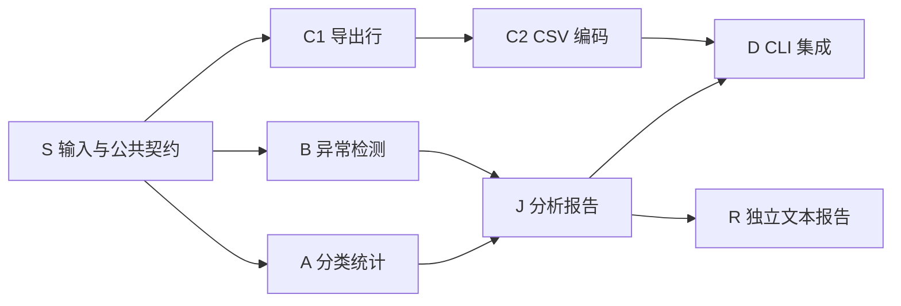

# 操作指南

本指南描述一次完整实测。round 准备可由工具创建环境；规划、批准 Scope 与需求、故障操作及业务步骤由操作者按剧本完成。

## 0. 前置条件

- 一个已通过 `pnpm lab:new` 准备好的 round；首次准备会运行 `doctor`，因此产生少量模型费用。
- 已按项目文档完成 Companion 的安装、Provider 与模型配置以及 Orca 能力核验，`doctor` 通过。
- 一个仓库外的输出目录，例如 `/abs/out`，用来存放采集证据与报告。
- 建议把并发上限设为 3、每 lane 上限 1、active Work Package 上限 8（取值见 `contract.json` 的 `executionLimits`）；当前产品的实际并发行为见 `capabilities.md`。

## 1. 验收程序

入口是 `pnpm lab`（等同 `node artifacts/ledger-lab/lab.mjs`）。验收命令可从 round 读取已配置身份与路径，也可继续使用显式参数：

```
node artifacts/ledger-lab/lab.mjs collect --repo /abs/testrepo --scope <S> --out /abs/out --watch [--interval-ms 2000] [--max-samples 1800]
node artifacts/ledger-lab/lab.mjs verify-result --repo /abs/testrepo --version initial|revised|privacy --out /abs/result.json [--entry src/cli.mjs] [--line-ending lf|crlf]
node artifacts/ledger-lab/lab.mjs verify-process --evidence /abs/out/evidence.jsonl --mapping /abs/mapping.json --observations /abs/obs.json --profile main|cancel --out /abs/process.json
node artifacts/ledger-lab/lab.mjs report --process /abs/process.json --observations /abs/obs.json --out /abs/report-dir [--result /abs/result.json]   # main 必需 --result
```

所有采集与核验命令可附 `--run /abs/round`；round 根目录默认为 `$XDG_STATE_HOME/orca-companion/ledger-lab`，否则 `~/.local/state/orca-companion/ledger-lab`。`--root` 可指定绝对外置 runs 根目录，`--settings` 可指定外置 JSON 设置。通过 `pnpm lab open --run /abs/round` 重开时只核验原身份，不推进流程；`pnpm lab configure` 修改设置前需已有构建产物或先运行 `pnpm lab:new`。

- `collect`：只读采集，在 `--out` 目录内新建 `evidence.jsonl`。`--watch` 持续采集，`--interval-ms` 默认 2000 毫秒（范围 200 到 60000）；`--max-samples` 是采样上限，默认 1800（范围 1 到 10000），达到上限即停止。
- `verify-result`：从仓库外运行固定 CLI，用外部输入核对实际输出，`--version` 选择初始、修订或隐私版的预期。`--entry` 默认取 `contract.json` 的 `entry`，`--line-ending` 默认 `lf`。
- `verify-process`：读取证据、映射与人工观察，按 `main` 或 `cancel` 档案核验过程断言，输出 `process.json`。
- `report`：把过程结论、结果结论和人工观察合并成 JSON 与 Markdown 报告。`--out` 必须是新目录，已存在则拒绝覆盖。`--result` 在 `main` 档案下必需，`cancel` 档案可省略；缺 `--result` 时不生成成品报告，也不伪造。

命令帮助还列出环境准备、配置和重开入口。版本规则（别名、脱敏、CSV 行序）、默认值、行尾与输出语义由 `contract.json` 的 `projections`、`defaults`、`lineEndings`、`limits`、`outputSemantics` 拥有；本文只引用，具体取值以合同为准。

### 1.1 证据样本（`evidence.jsonl` 每行一条）

```json
{
  "schemaVersion": 1,
  "kind": "sample",
  "sampleId": "sample-000001",
  "collectorId": "collector-20261005-a",
  "repositoryPath": "/abs/testrepo",
  "coordinationScopeId": "ledger-lab-20261005-scope",
  "startedAt": "2026-10-05T02:00:00Z",
  "observedAt": "2026-10-05T02:00:02Z",
  "sources": {
    "store": { "status": "available", "consistent": true, "errors": [] },
    "orca": { "status": "available", "runs": [{ "runId": "run_...", "result": "..." }], "errors": [] },
    "git": { "status": "available", "head": "abc123", "dirtyPaths": [] }
  },
  "snapshot": {
    "scope": {},
    "generations": [],
    "graphs": [],
    "patches": [],
    "bindings": [],
    "segments": [],
    "settlements": [],
    "recoveries": [],
    "holds": [],
    "reconciliations": [],
    "adoptions": [],
    "lineages": [],
    "intents": [],
    "budgets": [],
    "verdicts": [],
    "authorizations": [],
    "handoffs": [],
    "planningHandoffs": [],
    "interactions": [],
    "leases": [],
    "status": {}
  }
}
```

- 每个来源的 `status` 取 `available` 或 `unavailable`；不可用时在 `errors` 里写明，空数组表示确实无错误，不用来伪装不可用。
- `store.consistent` 只表示该样本前后 Scope revision 一致，不代表多个来源做了原子快照，也不用于推断跨来源一致；`git.head` 与 `git.dirtyPaths` 来自真实仓库，`orca.runs` 只列该次采集实际观察到的 Run。
- `snapshot` 各分区直接放生产侧的只读记录本体（源码 DTO），本指南不另定义它们的字段；记录缺失按不可用处理，不推断、不回填。
- `observedAt` 是采集时刻，不是 Worker 的起止时间。
- 证据日志上限 128 MiB 和 10000 条样本；出现不完整的一行按采集不完整处理，不静默丢弃。同一 `sampleId` 内容冲突时，必需场景记 `INCONCLUSIVE`。

### 1.2 过程报告（`process.json`）

报告顶层是：

- `checks`：数组，逐项为 `{id, title, group, status, message, evidence, assertions}`，`status` 取 `PASS`、`FAIL`、`BLOCKED`、`NOT_COVERED`、`INCONCLUSIVE` 之一，`id` 与生成清单取自 `contract.json` 的场景表。没有顶层 `statuses` 映射。
- `status`：只由必需场景组算出的总状态（`main` 对应 `core`，`cancel` 对应 `cancel`）。
- `summary`：全部检查按状态计数；`coverage.required` 与 `coverage.conditional` 分别给出两组计数。
- `capture`：样本数、store 一致的样本数、首末 `observedAt`。
- `observations`：原样带回观察数组，单列，不参与机器判定。
- 另有 `limitations`、`repositoryPath`、`profile`、`coordinationScopeId`、`kind:"process-report"`、`schemaVersion:1`。

机器证据只来自 `evidence.jsonl` 与公开的 Orca/Git 观察，观察笔记不能替代机器证据。某场景缺少可核验的样本序列、身份或回读时自动记 `INCONCLUSIVE`。总状态基于必需组的 `overall`（组内 `FAIL` > `BLOCKED` > 任一非 `PASS` 记 `INCONCLUSIVE` > 全 `PASS` 记 `PASS`），再叠加已证的 `conditional` `FAIL`：任一有确定性证据的 `conditional` `FAIL`（例如 Retry 改了授权或 contract）直接把总状态定为 `FAIL`。

`unknown`、`handoff`、`validator-repair`、`escalation`、`model-reauthorization` 发生后最多 `INCONCLUSIVE`，未发生是 `NOT_COVERED`，都不会自动 `PASS`。`parallel` 在授权并发上限为 1 时记 `BLOCKED`，并发上限大于 1 但没有捕获到同一 Run 内两条 lane 的真实 live Worker 时仍是 `NOT_COVERED`；`recovery` 只有明确阻塞记录时记 `BLOCKED`。Finalizer 只读性、Validator 修复和 Worker Escalation 的人工评级单列，与机器状态分开呈现。

worker 名单覆盖不完整时（collector 的 `complete:false`；adapter 只解析 `workers`，丢掉覆盖元数据，验证器按 `truncated`、`nextCursor` 与绑定缺失推断为不确定），即使捕获到 live Worker，`lane-capacity` 也只能记 `INCONCLUSIVE`，因为无法证明没有其他 Worker；若捕获到同一 lane 多个 live，仍记 `FAIL`。`parallel` 只要在同一 Run 内捕获到两条 lane 共存的 live Worker 正证据即可 `PASS`。每个 `PASS` 都是受限声明，只覆盖所捕获的时间窗与记录，并与人工观察分开呈现。

预算检查在整段采样历史上进行：某个 counter 在后续样本里消失、或同一 `approvedLimitRef/budgetKey` 的已消耗值回退，都记 `FAIL`。发生代际 cutover 时还要核验 `implementationAttempts`、`validatorRepairs`、`graphRevisions`、`specificationRevisions` 四项 lineage 继承的前后计数：缺前后样本记 `INCONCLUSIVE`，继承计数小于已消耗记 `FAIL`。

`cancel` 档案只看 `cancel` 这一必需场景组决定总状态；`core` 场景在取消运行里统一记 `NOT_COVERED`，表示不适用而不是失败，其余 `conditional` 场景照常记录。

### 1.3 退出码

- 0：`PASS`
- 1：`FAIL`
- 2：参数或文件错误
- 3：其他非通过（`BLOCKED`、`NOT_COVERED`、`INCONCLUSIVE`）

### 1.4 采集语义

- `collect` 收到 SIGINT 只停止采集，不做任何写入或状态变更。
- 不支持向已有日志追加：用独占新建（`wx`）写文件；重新采集就换一个新的输出目录。
- 所有输出都落在被测仓库之外。

### 1.5 结果报告（`result.json`）

`verify-result` 输出 `kind:"result-report"`：顶层有 `schemaVersion`、`version`、`entry`、`lineEnding`、`observedAt`、`status`、`checks`、`summary`（`total`、`passed`、`failed`、`blocked`、`inconclusive`），`checks` 逐项含 `id`、`status`、`message` 与差异详情。入口缺失或仓库不可用记 `BLOCKED`，超时或输出被截断记 `INCONCLUSIVE`。任何一项未通过都不会给 `PASS`。

JSON 按字段集合与内容比较，`byCategory`、`largePayments`、`duplicateGroups` 的排列顺序不被强制；CSV 的行序、表头与行尾被严格比较，字段按解析后的语义比较。所以提示词里中文类别的 UTF-16 升序是业务约定，机器不会因顺序不同就判失败。

验收会核对运行前后项目 Git 的 HEAD、index 与 status 不变，也不要求项目依赖第三方包。`revised` 的 golden 同时包含 C1 排序修订与别名归一化，只完成其中一条的中间态没有结果 golden，只能做过程验收。

### 1.6 合并报告（`report --out`）

`report` 输出 `kind:"acceptance-report"`：顶层有 `status`、`process`、`result`（cancel 时为 `null`）、`observations`、`assessments`（只含 `kind:"assessment"` 的条目）与 `summary`。`--out` 目录内同时写 `report.json` 与 `report.md`，用独占新建，目录已存在就失败。

Markdown 报告会显示 `HEAD 关联` 的状态与理由；取消档案没有成品报告时写“取消档案不要求成品交付”，不留空表。

## 2. 参考图（仅操作者）

`contract.json` 的 `referenceGraph` 是七个核心节点加一个独立文本报告节点：



统计、审计、导出分属三条 lane，S、J、D、R 属于协调 lane。随后的图补丁会新增 F（统计 lane，依赖 S）、把 A 改为依赖 F、退场 R。这张图只用于你核对规划质量；用 `mapping.json` 把节点映射到真实 WorkPackageId，节点名不同不算错，依赖结构一致即可。

R 是独立文本报告入口 `src/text-report.mjs`，只依赖输入契约与报告组装，不经过 CLI，因此不和 D 共享 `src/cli.mjs`。

Planner、Implementation、Validator、Recovery 与 Finalizer 是每个 Work Package 内部的生命周期角色，不是图节点，映射时不要混进来。

映射文件可以带可选的 `controlLanes`，按 orcaTaskId 把 Utility 与 Finalizer 这类控制角色归到 `coordination`。其他 lane 只按显式 Work Package 映射得到，不从标题猜。

## 3. 主剧本

按顺序执行。每一步给出提交内容、观察点、采集建议与结论要点。

### M1 规划与授权（planning）

提交 `prompts.md` 的初始需求，不要预置图或审批记录。

观察模块划分是否形成独立 lane，是否存在局部汇合 J 与最终汇合 D，工作量是否合理，独立文本报告（入口 `src/text-report.mjs`）是否成为单独节点。

授权前 `collect` 一次，授权后再 `collect` 一次；此后可加 `--watch` 持续采集。

把参考图节点映射到实际 WorkPackageId，写入 `mapping.json`。规划结构由机器对首代图与参考图的依赖闭包做受限比较；你只记录观察，不自行判定通过。

### M2 跨 lane 并行与每 lane 独占（parallel、lane-capacity）

授权后，最先就绪的多条 lane 应各自进入工作。

观察同一时刻不同 lane 是否存在活跃 Worker，以及同一 lane 任一时刻是否只有一个 Worker。

机器只对捕获到的 Worker 观察序列做受限判定：`parallel` 需要同一 Run 内两条 lane 共存的 live 正证据，`lane-capacity` 在名单覆盖不完整时即使有 live 也记 `INCONCLUSIVE`。你只记录观察（note），不把串行读成通过。产品当前是否并行见 `capabilities.md`。

### M3 C1 规格修订（specification-revision，窗口：C1 尚未 Accepted）

在导出行准备（C1）还没有 Accepted 时，提交 `prompts.md` 的 revision-c1，只改 CSV 行序。

观察是否在同一 Work Package 上追加规格修订，WorkPackageId 与 worktree 是否保留，旧验证结果是否失效并重新验收，规格修订预算是否扣减。

机器按 `holds` 里已释放的 `specification_revision` 与同包 worktree 是否保留做受限判定。你只记录观察：在窗口内提交记 `start` 或 `note`，C1 已经 Accepted 才提交就记 `missed`；不要自行写通过。不回滚、不改写历史。

### M4 原子图补丁（graph-patch，窗口：A 尚未 Accepted）

在统计（A）还没有 Accepted 时，提交 `prompts.md` 的 patch-afr：新增归一化前置、统计改为依赖它、去掉独立文本报告入口 `src/text-report.mjs` 与对应模块。别名归一化在这条落地，不要并入 M3 的 C1 修订。

观察是否一次补丁同时完成 add、revise、retire；F 是否获得新身份与新 worktree；A 是否保留 WorkPackageId 并追加 Graph Revision；R 是否只移出尚未接受的节点并保留历史。

机器按同一 Accepted Graph Patch 的 add F、revise A、retire R 与追加拓扑做受限判定。你只记录观察；补丁被拆成多次，或 A、R 已经 Accepted，把实际现象写清楚，不替机器下结论。

### M5 局部阻塞与汇合（local-block、joins）

导出 lane 在需要 CSV 运行验收材料时，Companion 会向你提问。先不提供材料。

观察 C2 是否阻塞；其他 lane（统计、审计）是否继续实际推进；A、B 验收后 J 是否可以先完成（J 只依赖 A、B）；D 是否因为缺 C2 而不能推进。

这次等待中的提问就是“人工 Question”的证据。如果 Coordinator 没有向用户提问、自行推进，记录一条 `missed`，说明人工提问没有自然发生。

随后提交 `prompts.md` 的 CSV 验收材料，观察 C2 是否解除阻塞并验收，D 是否因此获得完整依赖。

运行时材料按当时版本给。这里给一份固定最小样例，JSON 输入如下：

```json
[{"id":"b","category":"餐饮","merchant":"Acme, Inc.","amountCents":6000},{"id":"a","category":"交通","merchant":"Line1\nLine2","amountCents":100}]
```

initial 版本（id 升序、lf）：

```
id,category,merchant,amountCents
a,交通,"Line1
Line2",100
b,餐饮,"Acme, Inc.",6000
```

revised 版本（金额降序、同额按 id 升序、lf）：

```
id,category,merchant,amountCents
b,餐饮,"Acme, Inc.",6000
a,交通,"Line1
Line2",100
```

privacy 版本与 revised 相同，只把 merchant 换成 `[redacted]`。末尾换行可选。样例以你提供的为准，这里只是固定可复用的起点。

中间态只完成一条变更（只有 revision-c1 或只有 patch-afr）时不要跑 `verify-result revised`：那一版 golden 需要 C1 排序与别名归一化同时到位。中间态只做过程验收。

机器按 C2 的局部 blocker 与相邻采样中无关 lane 包的接受结果做受限判定；汇合按物化前的前驱接受快照判定，缺快照记 `INCONCLUSIVE`。你只记录观察。

### M6 全局暂停与恢复（pause-resume）

对整 Scope 执行 Pause，再 Resume。

观察 Pause 后是否停止新的模型恢复与 Worker 派发，同时已运行 Worker、事件落盘与对账是否继续；Resume 是否先对账再恢复调度。

暂停要在确有活跃 Worker 时发起，否则机器只能得到 `INCONCLUSIVE`（缺少活跃前态）。你只记录观察，不自行记为通过。

### M7 退出重入（restart）

Exit 或 Ctrl+C 只退出前台，不隐式暂停或取消。重新进入同一 Scope。

观察 Scope、Session、Graph Generation、Run、lease 与 fencing 是否保持，是否重复派发，待答问题是否保留。

机器按 runtime fencing 前进且原 Graph/Run/Task/worktree 保留来判定；重入时没有观察到 fencing 前进，或新旧样本缺一侧，给 `INCONCLUSIVE`。你只记录观察。

### M8 Worker 恢复（recovery）

在一个真实 Worker 运行中，手动中断它的会话，例如关闭它所在的 agent 终端。

观察是否记录 Session Segment；是否由受限 Utility Worker 从精确 transcript 生成 Recovery Capsule；替代 Dispatch 与 Session 是否仍属于同一业务 Attempt；恢复预算是否扣减且有限。

不要把停止命令成功当作 Worker 已退出，也不要把替代 Worker 已启动当作恢复成功。你只记录观察：中断没成功制造时记 `missed`，明确阻塞时记 `blocked`；机器按 recovery 记录判定。

### M9 预算不重置（budget）

跨越 M7 的重启、M8 的恢复、M4 的补丁与 M10 的重规划，检查已消耗预算。

观察各项上限是否为有限整数，以及重启、恢复、补丁、重规划之后已消耗预算是否保持，是否出现重复派发。

机器在整段采样历史上核验预算：某个 counter 在后续样本里消失、或同一 `approvedLimitRef/budgetKey` 的已消耗值回退，都记 `FAIL`。发生代际 cutover 时还要核验四项 lineage 继承的前后计数；缺前后样本记 `INCONCLUSIVE`，继承计数小于已消耗记 `FAIL`。你只记录观察。

### M10 重规划与代际切换（replanning，窗口：最终 CLI 尚未 Accepted）

在最终 CLI 还没有 Accepted 时，提交 `prompts.md` 的隐私重规划需求。

观察是否停止新派发，结清在途 Worker、Delivery、Pending Interaction 与 Operation Intent，释放 Execution Lease 并建立新的 Planning Cycle；新代际是否产生新的 Graph Generation、GraphId、Run、WorkPackageId 与 worktree；旧成果是否按 baseline adoption、migration material、planning reference 处置；是否避免复用旧完成状态；Generation Cutover 之后前代是否冻结。

机器按前代冻结、新代 Graph/Run/WorkPackage 身份分离做受限判定。成果采用（baseline adoption、migration material）是否得当要你自己核对并写成 `assessment`，不要用一句通过把语义泛化。

若最终 CLI 已经 Accepted 才提交重规划，前代成果已交付，lineage 语义不同，按实际记录并标注。

### M11 独立交付结论（finalizer）

所有 Work Package 通过后，Finalizer 用新的只读项目级 Session 检查整个项目并给出 Delivery Verdict。

观察只读 profile 是否成立，检查前后项目工作区事实是否一致，结论覆盖范围是否完整。机器只按 Delivery Verdict 已接受、只读 profile、冻结与前后工作区一致做受限判定；你记录观察并单独写 `assessment`。

### M12 结果验收与报告

先停调度，确认交付完成、最后一次采集已经落盘，再做成品验收，避免正在进行的集成改动 HEAD。

在仓库外运行 `verify-result`，按实际交付版本选择 `--version`（重规划后通常是 `privacy`），并带上实际行尾，核对 CSV 与 JSON 输出。

再运行 `verify-process --profile main`，然后运行 `report`（`main` 必须带 `--result`）。合并报告会做一项 `correlation` 核对：最后一条过程样本的 Git HEAD 必须与成品验收的 before/after HEAD 一致；缺失或不一致记 `INCONCLUSIVE`，需要复核实测时点，不要把它当成程序错误。

人工复核报告结论。

## 4. 取消短剧本（cancel）

取消用另一个一次性的独立 Git 仓库与独立 Scope，不要与主剧本共用。仓库是临时最小工程，只实现 `src/count.mjs` 一个工具。

先在 Companion 里提交 `prompts.md` 的“取消运行的初始需求”，完成规划与授权，让第一个 Worker 进入 active，再执行 Scope Cancel。

取消只需要最小映射，不必凑 8 个节点，例如：

```json
{
  "schemaVersion": 1,
  "coordinationScopeId": "<cancel-scope>",
  "graphs": [
    { "graphId": "<cancel-graph>", "nodes": { "S": "<actual-wp-id>" }, "lanes": { "<actual-wp-id>": "coordination" } }
  ]
}
```

观察取消意图是否先保存，是否停止模型并请求 Worker 停止，结果未确认时是否保持 `cancelling` 或 `unverifiable`，以及迟到的 Worker 结果是否不会重新激活当前代际。

无法在活跃 Worker 下完成取消时记录 `missed`；机器按取消区间的物化与新样本判定。完成后运行：

```
node artifacts/ledger-lab/lab.mjs verify-process --evidence /abs/out/evidence.jsonl --mapping /abs/mapping.json --observations /abs/obs.json --profile cancel --out /abs/cancel-process.json
node artifacts/ledger-lab/lab.mjs report --process /abs/cancel-process.json --observations /abs/obs.json --out /abs/cancel-report-dir
```

取消运行通常没有交付 CLI，所以不带 `--result`，也不会为此伪造成品报告。取消不做 8 节点参考图规划，`cancel` 档案下 `core` 场景统一记 `NOT_COVERED`（不要求），总状态只由 `cancel` 场景决定；`main` 与 `cancel` 分开评估。

## 5. 条件检查表

`contract.json` 里 `group` 为 `conditional` 的场景不一定自然发生。发生时记录观察，未发生记 `missed`；判定由机器按证据做受限检查，多数条件场景没有自动正证据，只会得到 `INCONCLUSIVE`：

- retry：普通重试是否保持原 WorkerTask 与 contract，只新增 Attempt 与 Dispatch。
- validator-repair：Validator 是否在授权范围内修复并复验，是否复用同一真实 Session。
- unknown：mutation 响应丢失时是否用同一 OperationId 对账，是否不换 ID 重试。
- escalation：Worker Escalation 是否被当作结构化输入处理。
- handoff：Coordinator 交接是否保留身份与上下文。
- model-reauthorization：只换模型配置时是否按完整 Manifest 指纹与 Scope revision 重新批准，且不创建 Graph Revision。

## 6. 时机窗口与错过处理

几个场景有时机要求，错过就不可复得。你的职责是记录观察：在窗口内提交记 `start` 或 `note`，错过记 `missed`，明确挡住的记 `blocked`。判定由机器按真实来源做受限检查，不要自己写通过，也不伪造、不回滚已接受节点、不改写历史。

机器在这些场景的受限行为：

- C1 规格修订与 A 图补丁：只在窗口内发生才有正证据；没发生或错过时对应检查没有证据，给 `NOT_COVERED`。
- 局部阻塞：需要 C2 有明确 blocker，且相邻采样里无关 lane 的包取得接受结果；样例早给或 Coordinator 不问则无证据。
- 暂停与恢复：需要活跃前态与恢复后态；缺一侧给 `INCONCLUSIVE`。
- 退出重入：需要 runtime fencing 前进且原身份保留；缺一侧给 `INCONCLUSIVE`。
- Worker 恢复：没造成中断则无证据；有中断但 transcript 或预算不足时按阻塞记录给 `BLOCKED`。
- 重规划：需要前代冻结、新代身份分离；成果采用的语义另由人工 `assessment`。
- 取消：需要活跃前态与取消区间无新物化；缺活跃前态给 `INCONCLUSIVE`。

C1 与 A 的修订最容易错过，因为工作包可能很快进入 Accepted。建议在授权后、目标工作包还在运行时立即提交修订与补丁，不要等显著进展。

## 7. 人工观察与四维体验

用 `observations.example.json` 的格式记录观察，`scenarioId` 取自 `contract.json` 的场景清单，`kind` 取 `note`、`start`、`end`、`blocked`、`missed`、`assessment`，只有 `assessment` 带 1 到 5 的 `rating`。

人工声明不能当成机器 `PASS`。你对结果的认可要用 `assessment` 单独标注，报告里也会与机器结论分开呈现。

人工评级只作参照，不能把机器状态从非 `PASS` 抬成 `PASS`；结构记录不足时机器状态是 `INCONCLUSIVE`。

体验看四个维度，每个维度至少一条 `assessment`，把维度写在 `text` 开头（`清晰度:`、`干预次数:`、`问题处理:`、`可复跑性:`）：清晰度看规划与状态是否易懂；干预次数看你被迫手工介入的次数；问题处理看阻塞、恢复与待答是否处理得当；可复跑性看换个模型再跑一次能否得到相近结果。

## 8. 状态定义

- `PASS`：机器证据在观测窗口内证明了该场景的断言。
- `FAIL`：机器证据与该场景断言矛盾。
- `BLOCKED`：因产品缺口或环境原因无法继续，且记录了原因。
- `NOT_COVERED`：场景没有发生，或窗口错过，不做判断。
- `INCONCLUSIVE`：证据不足或互相矛盾，既不能证明也不能证伪。

功能正确性、过程规则、覆盖率、规划结构与人工体验分开报告；未覆盖与不确定不合并成通过。用量只统计精确绑定的可信 usage，不估算缺失的 token 或费用。
