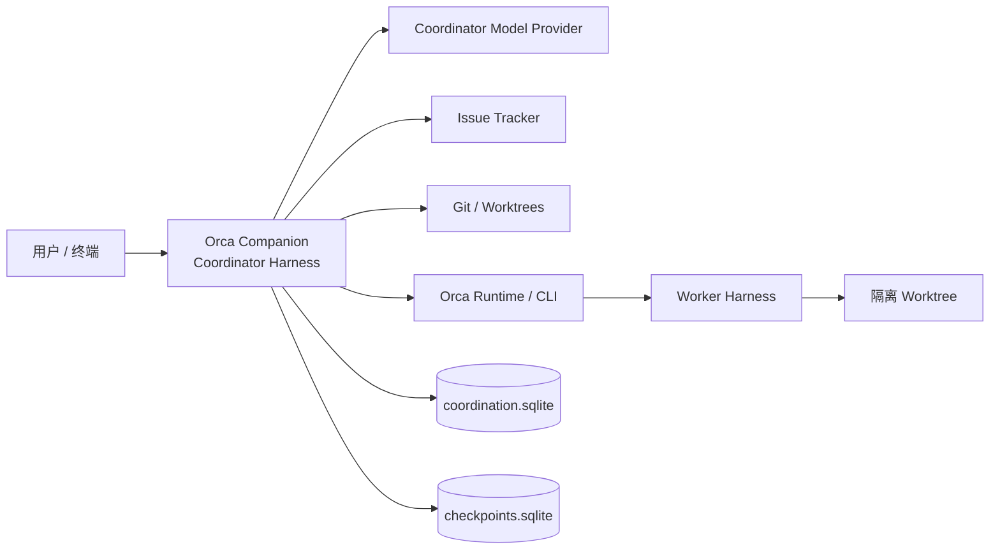
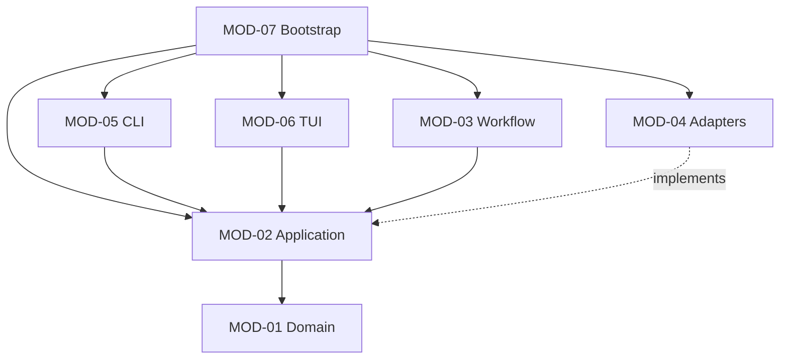
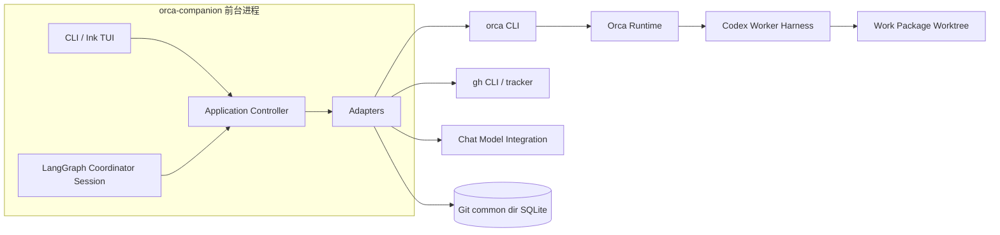
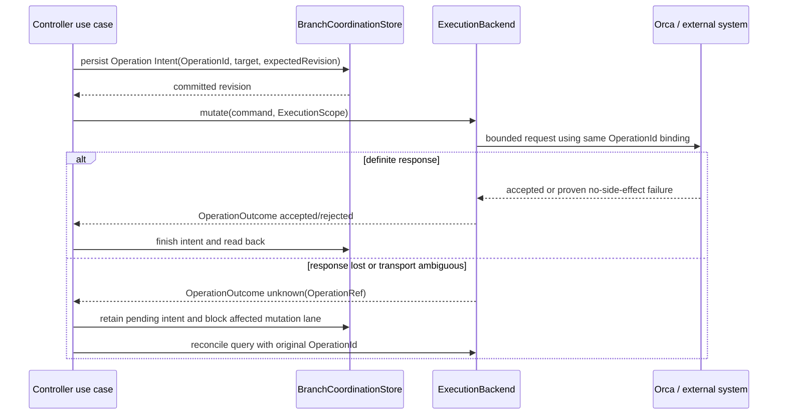
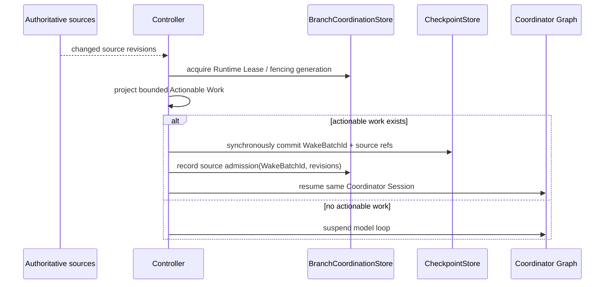
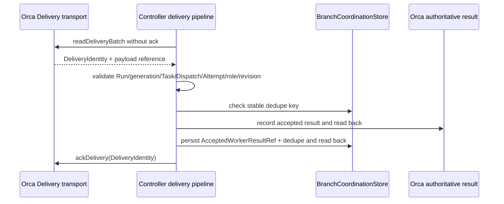
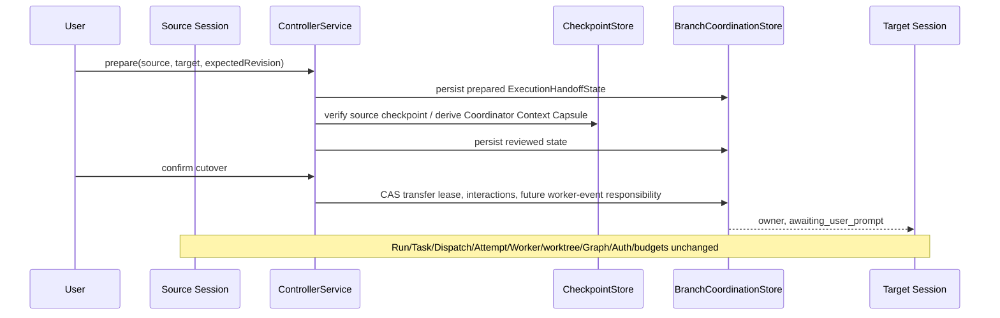

# Orca Companion 架构基线

本文是代码模块、运行组件、依赖方向和跨系统调用顺序的事实源。领域词汇及权威事实定义见 [`CONTEXT.md`](../CONTEXT.md)，字段级接口见 [`interface-contracts.md`](interface-contracts.md)。后继 OpenSpec change 通过 `MOD-*`、`IC-*` 和 `FLOW-*` 引用合同；编号不得重排。

本文中的 **module** 是具有 interface 与 implementation 的代码单元，**seam** 是 interface 所在位置，**adapter** 是满足外部 seam 的实现。**运行组件**只表示进程或外部系统，**React 组件**只表示 Ink/TUI 的渲染单元。

## 系统上下文

Companion 是单个前台进程，只运行 Coordinator Agent。Orca 拥有 Run、Task、Dispatch、Worker、Delivery、receipt 与 Accepted Worker Result；Worker Harness 拥有 provider session 和 transcript；Git 拥有代码、HEAD 与 worktree；issue tracker 拥有 Route Map 和 Decision Ticket。两个 SQLite store 只保存无法从这些来源重建的协调事实与 Coordinator Session checkpoint。

## 模块依赖

箭头只指向调用方可依赖的 module。Application 定义外部 seam，Adapter 实现它；因此 Adapter 对 Application 的依赖是实现关系，不允许 Application 反向导入 Adapter。共享 DTO 沿同一方向定义，不能放进一个所有层都依赖的 `shared` 目录。

## Module 合同

### MOD-01 Domain

| 项目 | 合同 |
|---|---|
| Canonical path | `src/domain/` |
| 职责 | Coordination Scope、模式、授权、Execution Graph、预算、Worker 生命周期与纯状态规则 |
| 允许依赖 | TypeScript 标准语言能力及同层领域模块 |
| Interface | 纯类型、判别联合和确定性函数；输入事实，返回决定或结构化拒绝 |
| 禁止 | LangGraph、Orca、Ink、React、进程、文件路径、SQL、时钟读取、网络或 adapter 类型 |
| 测试 seam | 直接调用公开领域 interface；不为测试增加 port |

### MOD-02 Application

| 项目 | 合同 |
|---|---|
| Canonical path | `src/application/` |
| 职责 | Controller 用例、准入、对账、意图、查询/命令 DTO、ports 和界面 façade |
| 允许依赖 | `MOD-01`；由调用方注入的 ports、时钟或 ID 函数 |
| Interface | `IC-02`–`IC-11` 中由 Application 拥有的 ports、commands、queries 和 projections |
| 禁止 | 导入具体 adapter、打开数据库、拼接 CLI argv、渲染 UI、复制外部状态机 |
| 测试 seam | 经生产调用方使用的同一用例或 port，注入最小 fake/mock adapter |

Application 是业务规则的外部 interface。小型纯用例可以直接是函数；只有真实 I/O 或生产/测试双实现才引入 port。`ControllerService` 是 CLI/TUI 的组合 façade，不拥有第二套状态转换。

### MOD-03 Workflow

| 项目 | 合同 |
|---|---|
| Canonical path | `src/workflow/` |
| 职责 | Coordinator Agent 的 LangGraph loop、模型/tool 节点、checkpoint 恢复与 suspend |
| 允许依赖 | `MOD-02` 的用例与 DTO、LangGraph interface、注入的 chat model |
| Interface | Coordinator graph 的启动/恢复入口和 checkpoint 所需 Session state |
| 禁止 | 另建业务状态机、直接调用 Orca/SQLite、重验一套不同的授权或预算、节点重启整张图 |
| 测试 seam | fake chat model 加真实 Application interface；不 mock 领域规则 |

### MOD-04 Adapters

| 项目 | 合同 |
|---|---|
| Canonical path | `src/adapters/orca-cli/`、`agents/`、`storage/`、`tracker/`、`specification/` |
| 职责 | 把外部协议、进程、provider session、SQLite、tracker 和工具原生 specification 转成 Application contracts |
| 允许依赖 | `MOD-02` ports/DTO、外部库或 Node 平台能力；必要时依赖 `MOD-01` 的值类型 |
| Interface | 只实现既有 seam，不向调用方暴露 transport 私有对象 |
| 禁止 | 决定模式转换、预算、准入、重试、图推进或 UI 状态；直接读写 Orca DB 或私有 RPC |
| 测试 seam | contract test 覆盖 parser/error passthrough；真实集成只在显式隔离目标运行 |

Adapter 以外部系统为单位保持内聚。`orca-cli` 只做封闭 operation catalog、进程和 schema 转换；`storage` 的两个 adapter 分别实现 Branch Coordination Store 与 LangGraph checkpointer，不共享表或伪装跨库事务。

### MOD-05 CLI

| 项目 | 合同 |
|---|---|
| Canonical path | `src/interfaces/cli/` |
| 职责 | `status [--json]`、`doctor` 与顶层 argv 解析 |
| 允许依赖 | `MOD-02` 的只读查询/`ControllerService`、Bootstrap 注入的启动能力 |
| Interface | stdout 机器输出、stderr 诊断、稳定退出码 |
| 禁止 | 加载 Ink/React、要求 TTY、自行推进状态、直接调用 adapter、在查询时续租或对账 |
| 测试 seam | 无 TTY 子进程测试和 DTO projection 测试 |

### MOD-06 TUI

| 项目 | 合同 |
|---|---|
| Canonical path | `src/interfaces/tui/`、`src/application/tui/view-model.ts` 与 `src/application/execution/execution-view.ts` |
| 职责 | Ink transcript、composer、sidebar、overlay、Graph Inspector、输入映射，执行态/规划态纯展示 projection，以及执行阶段只读派生（`execution-view.ts`） |
| 允许依赖 | `IC-11` Controller façade 和 `IC-12` view model；Ink/React |
| Interface | 用户 intent、选中 Session、局部草稿/滚动/overlay 状态和渲染帧 |
| 禁止 | 调用 Orca、打开 store、恢复模型、实现重试/准入/预算、从自由文本推断待答 interaction；`execution-view.ts` 只从 IC-03 快照与调用方读到的只读观察派生，不派发、不写、不实现对账 |
| 测试 seam | 组件经固定 view model 与 command callbacks 测试；PTY 单独验证 TTY/CJK/resize |

React 组件只拥有展示与输入协调。render、effect、resize 和重挂载没有业务副作用；所有 Scope 级动作必须经 `ControllerService`。

### MOD-07 Bootstrap

| 项目 | 合同 |
|---|---|
| Canonical path | `src/bootstrap/` |
| 职责 | 配置、依赖注入、能力核验、启动顺序、信号和进程生命周期；前台宿主的执行阶段只读观察装配（`worktree-list`/`worker-list`）、Scope 控制与 Execution Handoff 意图接线 |
| 允许依赖 | 所有 module 的公开 interface 以完成组合 |
| Interface | core/CLI/TUI 启动入口与 `doctor` 组合报告 |
| 禁止 | 持有领域规则、复制用例、在 import 时启动进程、让核心入口加载 UI 或数据库 |
| 测试 seam | 注入 fake ports 验证装配顺序；进程行为使用子进程/PTY 测试 |

## 运行组件与部署关系

前台 TUI 退出只停止本进程；活跃 Worker 可能继续。重新启动时 Bootstrap 先恢复 store、取得 Runtime Lease 并对账，再允许模型恢复或新派发。M0–M2 没有后台 controller、远程 attach 或 headless run。

## 权威归属

| 事实 | Owner | Companion 可保存的内容 |
|---|---|---|
| Route Map、Decision Ticket | Issue tracker | 引用、claim 和 pending interaction |
| 代码、HEAD、index、worktree | Git 与 Orca | expected HEAD、Operation Intent、可丢弃 binding |
| Run、Task、Dispatch、Worker、Delivery、receipt、Accepted Worker Result | Orca | 去重键、引用和控制记录，不复制正文 |
| Execution Graph | Implementation Plan + accepted Graph Revision 历史 | append-only graph history 与当前引用 |
| 共享协调事实 | `coordination.sqlite` | mode、leases、claims、intents、budgets、interactions、CAS revision |
| Coordinator Session | `checkpoints.sqlite` | 已提交消息/tool step、图位置、Wake Batch、Context Capsule |
| Worker Harness session/transcript | Worker Harness | 精确 Session Binding、Segment 与 transcript 引用 |

## 跨接缝流程

### FLOW-01 Side effect intent 与 unknown 对账

Intent 必须先于外部 mutation 落盘。`accepted` 只表示外部系统记录了确定结果；`rejected` 仅用于能证明副作用未发生的本地拒绝；其余为 `unknown`。unknown 只用原 OperationId 对账，不能换 ID 重试。详见 `IC-02`、`IC-03`。

### FLOW-02 Actionable Work 与 Wake admission

普通进度、keepalive 和无变化对账不形成 Actionable Work。两个 SQLite store 不做跨库事务；崩溃后以稳定 WakeBatchId 和 source revision 补齐，已提交 batch 不重复注入。详见 `IC-03`、`IC-04`。

### FLOW-03 Delivery settlement

任一核验或落盘步骤不确定时都不 ack、不推进生命周期。Accepted Worker Result 正文只归 Orca，本地只保存稳定引用和去重事实。重放走同一 pipeline。详见 `IC-02`、`IC-08`。

### FLOW-04 Execution Handoff

prepare 和 review 不转移责任。cutover 失败或 Capsule 不可移植时 Source 仍是唯一 owner；Target 在用户下一条普通 Prompt 前不自动恢复模型。普通 suspend/Wake 不构成交接。详见 `IC-09`、`IC-11`。

## 合同导航

| Module | 主要接口合同 |
|---|---|
| MOD-01 Domain | IC-01、IC-05–IC-10 |
| MOD-02 Application | IC-02–IC-11 |
| MOD-03 Workflow | IC-04、IC-11 |
| MOD-04 Adapters | IC-02–IC-10 |
| MOD-05 CLI | IC-11、IC-12 |
| MOD-06 TUI | IC-11、IC-12 |
| MOD-07 Bootstrap | IC-02–IC-04、IC-11、IC-12 |
