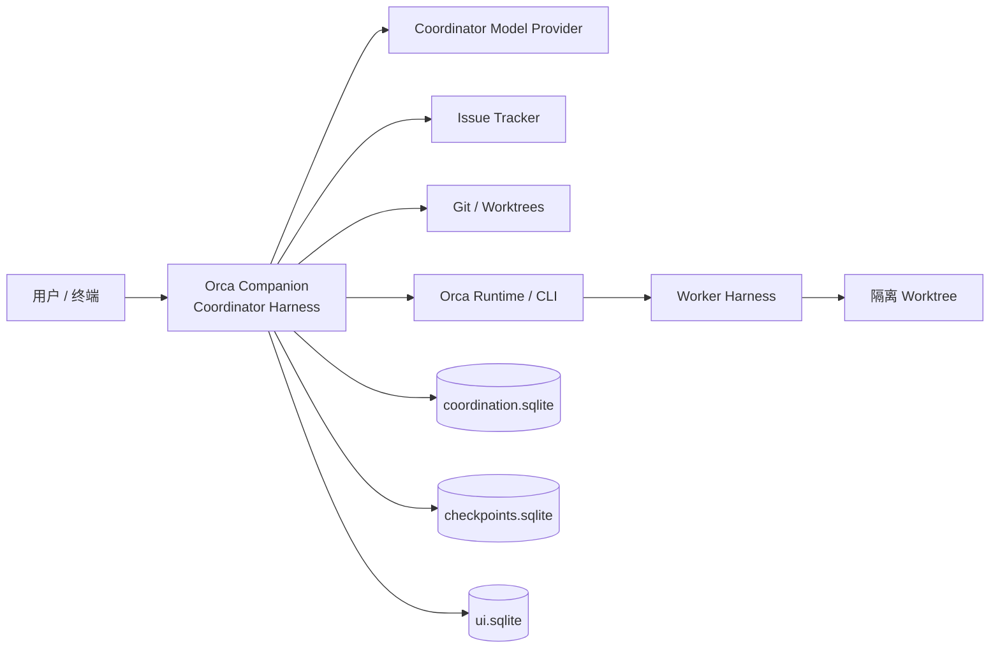
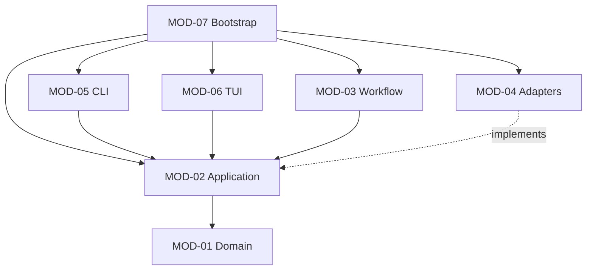
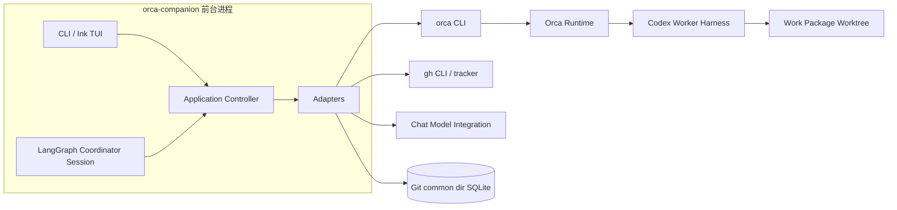
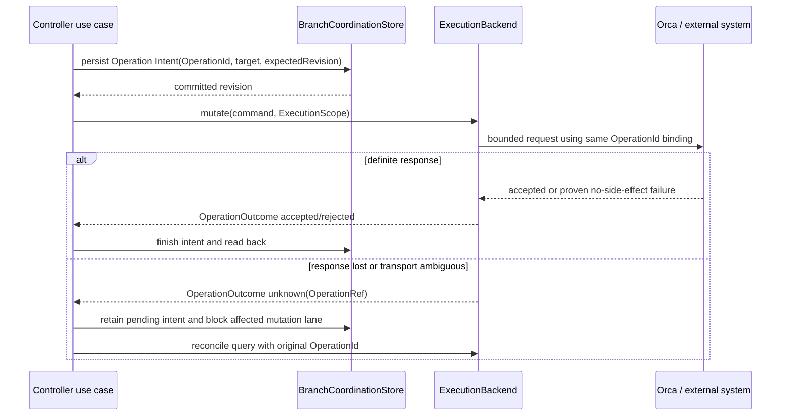
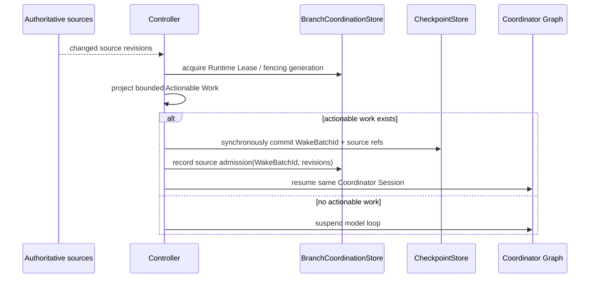
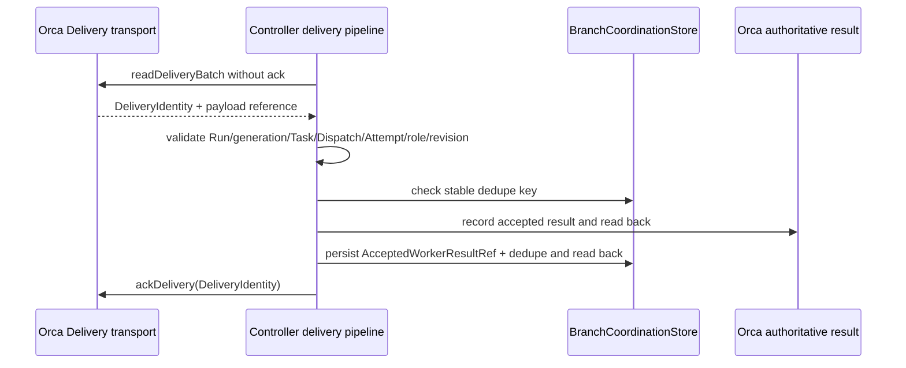
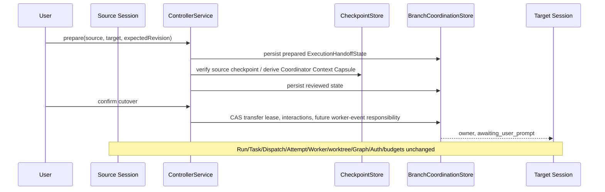
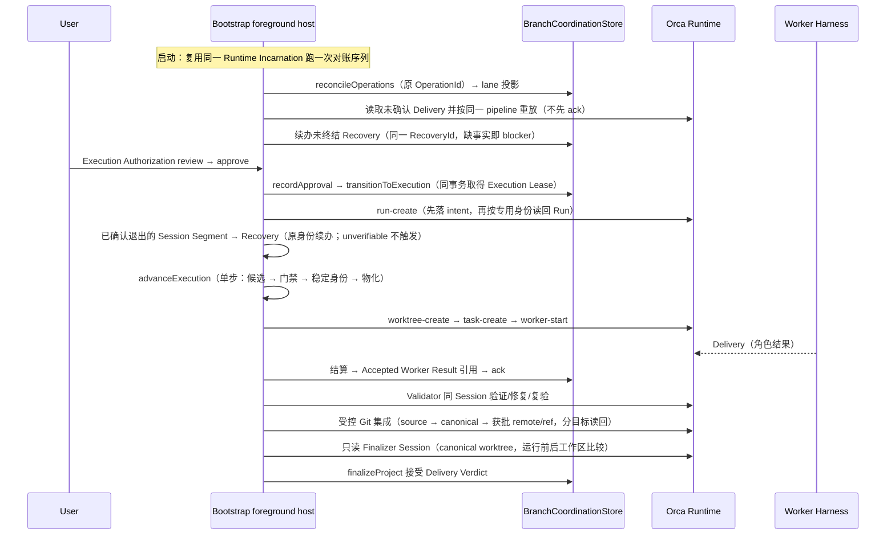
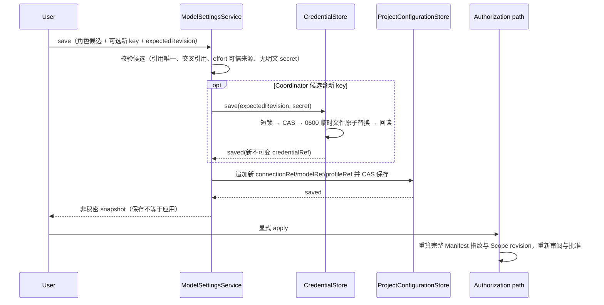

# Orca Companion 架构基线

本文是代码模块、运行组件、依赖方向和跨系统调用顺序的事实源。领域词汇及权威事实定义见 [`CONTEXT.md`](../CONTEXT.md)，字段级接口见 [`interface-contracts.md`](interface-contracts.md)。后继 OpenSpec change 通过 `MOD-*`、`IC-*` 和 `FLOW-*` 引用合同；编号不得重排。

本文中的 **module** 是具有 interface 与 implementation 的代码单元，**seam** 是 interface 所在位置，**adapter** 是满足外部 seam 的实现。**运行组件**只表示进程或外部系统，**React 组件**只表示 Ink/TUI 的渲染单元。

## 系统上下文

```mermaid
flowchart LR
  User[用户 / 终端] --> Companion[Orca Companion\nCoordinator Harness]
  Companion --> Model[Coordinator Model Provider]
  Companion --> Tracker[Issue Tracker]
  Companion --> Git[Git / Worktrees]
  Companion --> Orca[Orca Runtime / CLI]
  Orca --> Harness[Worker Harness]
  Harness --> Workspace[隔离 Worktree]
  Companion --> Coordination[(coordination.sqlite)]
  Companion --> Checkpoints[(checkpoints.sqlite)]
  Companion --> Inputs[(ui.sqlite)]
```

Companion 是单个前台进程，只运行 Coordinator Agent。Orca 拥有 Run、Task、Dispatch、Worker、Delivery、receipt 与 Accepted Worker Result；Worker Harness 拥有 provider session 和 transcript；Git 拥有代码、HEAD 与 worktree；issue tracker 拥有 Route Map 和 Decision Ticket。`coordination.sqlite` 与 `checkpoints.sqlite` 分别保存协调事实和 Coordinator Session checkpoint；`ui.sqlite` 独立保存尚未发送或待核验的用户输入。

Execution Coordination 的唯一 lease holder 可同时协调多个独立 Work Package。`ExecutionLimits.maxActiveWorkPackages` 是用户可配置的并行包额度（默认 3），`maxWorkPackages` 是图容量（默认 8）；同包角色顺序推进，canonical 集成串行。额度属于已批准 Manifest，ExecutionGraph 只描述工作与预算。

schema 20 的 Branch Store 在副作用前原子登记包级 lane，直到可证明集成或终止才释放；unknown 和待恢复的包继续占位。自动触发与 Coordinator 工具共用 `application/execution/advance-execution.ts` 的选包规则和事务准入。Bootstrap 只串行化 Scope 的短派发步骤，等待包级补救或合并复验时允许其他包继续推进。terminal 创建回执的精确句柄与原 Operation Intent 同事务结算；恢复重新核验原资源，不依赖可变显示标题，也不重新执行已接受的操作。

`application/integration-reconciliation.ts` 拥有稳定复验轮次、独立预算与 Git 意图；`bootstrap/integration-reconciliation-runtime.ts` 通过新的真实 Task/Dispatch 续接原 Validator provider Session。先在包内合并 canonical，再验证精确合并树，最后由 Controller 提交并快进 canonical。设置用例 `application/configuration/execution-settings.ts` 复用配置 CAS；保存默认值与批准执行期 Manifest 是两个明确用户意图，批准不重置图、Run 或已消费预算。

Worker Harness 的应用端口位于 `application/ports/worker-harness.ts`，bootstrap 的 `worker-harness.ts` 显式注册 codex、claude、opencode、pi、omp。角色生命周期只使用注册项的启动、恢复、证明、只读启动、探测与原生模型目录查询能力，terminal 创建、激活和接管仍由 `application/worker-launch.ts` 拥有。各 adapter 在 harness 真实用户环境中启动，负责精确 provider transcript 与运行时路径：`adapters/agents/worker-runtime.ts` 从真实 launch 环境解析非秘密 native roots，`adapters/agents/worker-model-catalog.ts` 提供有界、可取消的目录查询；模型、harness 与 effort 沿物化时固定的授权/profile 读取。原生只读启动与探针共用 `adapters/agents/read-only-execution-wrapper.ts`，Coordinator 凭据不经 Worker launcher。

## 模块依赖

```mermaid
flowchart TB
  Bootstrap[MOD-07 Bootstrap]
  CLI[MOD-05 CLI]
  TUI[MOD-06 TUI]
  Workflow[MOD-03 Workflow]
  Adapters[MOD-04 Adapters]
  Application[MOD-02 Application]
  Domain[MOD-01 Domain]

  Bootstrap --> CLI
  Bootstrap --> TUI
  Bootstrap --> Workflow
  Bootstrap --> Adapters
  Bootstrap --> Application
  CLI --> Application
  TUI --> Application
  Workflow --> Application
  Adapters -. implements .-> Application
  Application --> Domain
```

箭头只指向调用方可依赖的 module。Application 定义外部 seam，Adapter 实现它；因此 Adapter 对 Application 的依赖是实现关系，不允许 Application 反向导入 Adapter。共享 DTO 沿同一方向定义，不能放进一个所有层都依赖的 `shared` 目录。

## Module 合同

### MOD-01 Domain

| 项目 | 合同 |
|---|---|
| Canonical path | `src/domain/` |
| 职责 | Coordination Scope、模式、授权、Execution Graph、预算、Worker 生命周期与纯状态规则 |
| 允许依赖 | TypeScript 标准语言能力及同层领域模块 |
| Interface | 纯类型、判别联合和确定性函数；输入事实，返回决定或结构化拒绝 |
| 禁止 | LangGraph、Orca、Ink、React、进程、文件路径、SQL、时钟读取、网络或 adapter 类型 |
| 测试 seam | 直接调用公开领域 interface；不为测试增加 port |

### MOD-02 Application

| 项目 | 合同 |
|---|---|
| Canonical path | `src/application/` |
| 职责 | Controller 用例、准入、对账、意图、查询/命令 DTO、ports 和界面 façade |
| 允许依赖 | `MOD-01`；由调用方注入的 ports、时钟或 ID 函数 |
| Interface | `IC-02`–`IC-11` 与 `IC-13`–`IC-15` 中由 Application 拥有的 ports、commands、queries 和 projections |
| 禁止 | 导入具体 adapter、打开数据库、拼接 CLI argv、渲染 UI、复制外部状态机 |
| 测试 seam | 经生产调用方使用的同一用例或 port，注入最小 fake/mock adapter |

Application 是业务规则的外部 interface。小型纯用例可以直接是函数；只有真实 I/O 或生产/测试双实现才引入 port。`ControllerService` 是 CLI/TUI 的组合 façade，不拥有第二套状态转换。

### MOD-03 Workflow

| 项目 | 合同 |
|---|---|
| Canonical path | `src/workflow/` |
| 职责 | Coordinator Agent 的 LangGraph loop、模型/tool 节点、checkpoint 恢复与 suspend |
| 允许依赖 | `MOD-02` 的用例与 DTO、LangGraph interface、注入的 chat model |
| Interface | Coordinator graph 的启动/恢复入口和 checkpoint 所需 Session state |
| 禁止 | 另建业务状态机、直接调用 Orca/SQLite、重验一套不同的授权或预算、节点重启整张图 |
| 测试 seam | fake chat model 加真实 Application interface；不 mock 领域规则 |

### MOD-04 Adapters

| 项目 | 合同 |
|---|---|
| Canonical path | `src/adapters/orca-cli/`、`agents/`、`storage/`、`tracker/`、`specification/` |
| 职责 | 把外部协议、进程、provider session、SQLite、tracker 和工具原生 specification 转成 Application contracts |
| 允许依赖 | `MOD-02` ports/DTO、外部库或 Node 平台能力；必要时依赖 `MOD-01` 的值类型 |
| Interface | 只实现既有 seam，不向调用方暴露 transport 私有对象 |
| 禁止 | 决定模式转换、预算、准入、重试、图推进或 UI 状态；直接读写 Orca DB 或私有 RPC |
| 测试 seam | contract test 覆盖 parser/error passthrough；真实集成只在显式隔离目标运行 |

Adapter 以外部系统为单位保持内聚。`orca-cli` 只做封闭 operation catalog、进程和 schema 转换；`storage` 分别实现 Branch Coordination Store、LangGraph checkpointer 与 IC-13 UI 输入存储，不共享表或伪装跨库事务。IC-04 的会话历史在 checkpoint 库中按稳定 entry、正文块、step 和 Wake 关联追加，控制记录保持小型；正文范围与 metadata keyset 由 `application/coordinator/history.ts` 定义。有效上下文、工具恢复、待处理输入和 UI 分页各自按用途读取，压缩历史保留原文且不进入常规模型输入读取。TUI 只保留当前 Session 的有界正文/派生缓存及来源锚点；SQLite 是已提交原文的唯一权威。

`storage/credential-store.ts` 是版本控制之外唯一保存明文 secret 的地方，只服务 Coordinator 模型调用，与上面三个存储无关：单文件按 XDG 规则落在用户配置目录，短 exclusive 文件锁、revision CAS、0600 临时文件原子替换与回读；权限不安全的既有目录、文件与符号链接一律拒绝，且不 chmod 用户既有目录。它与项目配置文件之间没有跨文件事务，Coordinator 连接编辑先校验、写凭据并回读，再 CAS 追加用户库；项目显式选择完整快照；Worker 角色选择不写凭据，Worker 启动也不读取该 store。

### MOD-05 CLI

| 项目 | 合同 |
|---|---|
| Canonical path | `src/interfaces/cli/` |
| 职责 | `status [--json]`、`doctor` 与顶层 argv 解析 |
| 允许依赖 | `MOD-02` 的只读查询/`ControllerService`、Bootstrap 注入的启动能力 |
| Interface | stdout 机器输出、stderr 诊断、稳定退出码 |
| 禁止 | 加载 Ink/React、要求 TTY、自行推进状态、直接调用 adapter、在查询时续租或对账 |
| 测试 seam | 无 TTY 子进程测试和 DTO projection 测试 |

### MOD-06 TUI

| 项目 | 合同 |
|---|---|
| Canonical path | `src/interfaces/tui/`、`src/application/tui/view-model.ts` 与 `src/application/execution/execution-view.ts` |
| 职责 | Ink transcript、composer、sidebar、overlay、Graph Inspector、输入映射，执行态/规划态纯展示 projection，以及执行阶段只读派生（`execution-view.ts`） |
| 允许依赖 | `IC-11` Controller façade、`IC-12` view model、`IC-13` UI 输入、`IC-14` 模型设置与 `IC-15` 展示偏好端口；Ink/React 与 `@inkjs/ui` 展示组件 |
| Interface | 用户 intent、选中 Session、局部草稿/滚动/overlay 状态和渲染帧 |
| 禁止 | 调用 Orca、打开 store、恢复模型、实现重试/准入/预算、从自由文本推断待答 interaction；`execution-view.ts` 只从 IC-03 快照与调用方读到的只读观察派生，不派发、不写、不实现对账 |
| 测试 seam | 组件经固定 view model 与 command callbacks 测试；PTY 单独验证 TTY/CJK/resize |

React 组件只拥有展示与输入协调。render、effect、resize 和重挂载只读取与查询；用户输入事件经 IC-13 保存草稿与提交快照，所有 Scope 级动作经 `ControllerService`。Bootstrap 启动核验 pending 提交并清理已受理快照，恢复过程不自动发送。

第七批 `application/tui/project-presentation.ts` 是可信项目/Session metadata、有界项目详情及共享 Validator 验收摘要的 DTO owner。Bootstrap 从注册 Scope、精确 Session configuration/Claim、当前图与 Task 绑定批准事实组装，不让 UI 查询 tracker/store；context 只消费 installed integration 的精确当前输入测量能力，并在有效输入版本变化后失效。偏好 schema/port 位于 `application/configuration/tui-preferences.ts`，`storage/tui-preferences-store.ts` 以独立用户文件实现 IC-15；Bootstrap 注入窄端口，UI 只在明确保存事件提交单区 CAS patch。展示文件不进入业务/输入数据库。

第八批图历史与依据阅读由 `application/tui/graph-basis.ts` 的 `GraphBasisPort` 拥有，应用实现位于 `application/tui/graph-basis-service.ts`，与 IC-11 `ProjectDetailsPort` 分开。它读取跨代际版本 metadata、精确拓扑、追加链 membership、原始计划/补丁/批准 Manifest，以及精确绑定的原生规格和当前规划 tracker 来源。版本目录最多 20 项，正文范围最多 64 KiB；依据正文和布局缓存分别限 8 MiB/64 项。coordination schema 17 的 `initial_plan_json` 仅供初始图 v1 保存，初始新写与图记录同事务提交，旧行为 NULL；修订不覆盖。正文保持 JSON 原结构，由 SQLite BLOB 范围查询，不先全文编码。普通 snapshot 只包含当前拓扑，历史读取按所选 graph/generation/version 查询；generation status 只采用已登记状态，缺失显示 not_recorded。Work Package 级 retained task 不按时间归入某版，历史页不拼接当前执行态。原生规格 `readFiles`/`readFileRange` 是可选 provider 能力，按 workPackageId、orcaTaskId、locator 与 contract revision 精确绑定；tracking revision 单独表达。Tracker 仅能读取 Scope 当前配置的 routeMapIssueRef；没有历史正文记录的批准时来源明确缺失。

`render/transcript-reader.ts` 是对话阅读的唯一布局 owner：消费 IC-11 的 metadata/body/previews，维护 Session/source/revision/UTF-8 offset 锚点，并只产生可见行及前后缓冲。正文与派生布局各限 8 MiB/64 项，有限 Markdown 上下文计入派生额度。Marked 17 解析有限块；未知中段保留原文，不扫描全历史或计算全页高度。App 只协调读请求和键位，Transcript 只绘制 frame；其他 Session 仅保留标量位置。

历史检查 DTO 由 `application/coordinator/history-inspection.ts` 拥有。存储的派生调用索引只保存原 metadata 的参数字节范围、可信调用关联及活动摘要；Bootstrap 分批准备索引，读端不补齐。工具注册表的 `mutating` 决定分类，unknown 观测不产生配对结果。`history-search.ts` 独立扫描保留原文与参数，不依赖 Markdown 或展示缓存，每批有限且可取消。TUI 的整体详细、活动导航与查询上下文消费这些来源；输入历史只取当前 Session 的普通用户 entry，预览采用前不写草稿。

待答联动沿用同一 reader：HistoryCall 的可信 operationId 经应用用例正向派生问题 ID，摘要按指定 ID 有界读取，Q/A 正文范围由 Branch Store 拥有。生产展示 snapshot 的交互分区采用有界摘要与完整 Scope/Session count，执行准入仍取完整计数。项目待答使用独立 Scope keyset 页；显式选题通过原提交保护管线切 owner Session，返回上下文只保存展示位置和焦点，输入留在 IC-13，迟到结果不恢复已失效入口。

Workflow 的 `coordinator/model-call.ts` 消费真实模型 stream，SDK 的等待式 end callback 提供唯一完整响应。Application 的 stream observer 将临时片段送至 `adapters/storage/transcript-preview-store.ts`；临时文件总额 64 MiB/64 项，由 Bootstrap 生命周期清理，不参与恢复。正式接受沿原 appendModelStep 事务；Scope Cancel 在持久化意图后中止调用，Pause 保留在途响应，关闭/失去 fencing 也中止调用。失效订阅合并到约 30fps，不发布 token 语义事件或读取 Scope 快照。

Composer 的纯编辑模块拥有 grapheme 光标、原子粘贴范围和有界 viewport；正文在 UiDraft 中只有一份。当前 Session 的回答面板与粘贴 viewer 消费窄查询和同一输入保护管线。应用 Pending Interaction 用例拥有问题创建/重放与回答，Branch Store 拥有问题正文；workflow 的共享 `ask_user` 在两种模式和恢复注册表接线，不增加业务状态机。问题列表最多 20 条，详情按身份精确读取，Scope snapshot 不复制正文。

开发预览 `scripts/tui-preview.mjs` 只向构建后的 TUI 注入隔离假端口；主题由 `src/interfaces/tui/theme.ts` 统一提供。普通场景拒绝写入，alignment 场景在内存中模拟 accepted 以观察交接/确认后的展示，不连接生产 Bootstrap 或真实后端。

命令定义由 `src/interfaces/tui/commands.ts` 拥有：目录、slash、固定键位和帮助共用，搜索查询按页面隔离并限制为256 code points。App 按对象 ID 选择，捕获调用目标、输入 generation 和页面 generation；异步结果只影响原入口。每个 mutation 目标有有界的进程内在途/unknown 防重复记录，未知结果只读应用拥有的引用，查询拒绝不能解除原 mutation 的未知状态。guard 覆盖 action、精确读取及刷新；已受理但刷新失败保留 UI `refreshFailed` 与原输入，核验只重读状态。此记录不持久化、不驱动调度；重启恢复仍由原权威记录和 IC-13 输入负责，界面不自动重试。审阅与确认逐层返回；交接成功保留当前选中 Session，用户显式选择目标会话。

### MOD-07 Bootstrap

| 项目 | 合同 |
|---|---|
| Canonical path | `src/bootstrap/` |
| 职责 | 配置、依赖注入、能力核验、启动顺序、信号和进程生命周期；前台宿主的执行阶段装配：启动对账与 Resume 门、Execution Authorization 授权切换、单步 Frontier 推进（`advanceExecution`）、Delivery 结算与 Recovery 续办、受控 Git 集成、只读 Finalizer 派发，以及 Scope 控制与 Execution Handoff 意图接线 |
| 允许依赖 | 所有 module 的公开 interface 以完成组合 |
| Interface | core/CLI/TUI 启动入口与 `doctor` 组合报告 |
| 禁止 | 持有领域规则、复制用例、在 import 时启动进程、让核心入口加载 UI 或数据库 |
| 测试 seam | 注入 fake ports 验证装配顺序；进程行为使用子进程/PTY 测试 |

## 运行组件与部署关系

```mermaid
flowchart LR
  subgraph Process[orca-companion 前台进程]
    UI[CLI / Ink TUI]
    Controller[Application Controller]
    Graph[LangGraph Coordinator Session]
    AdapterSet[Adapters]
  end

  UI --> Controller
  Graph --> Controller
  Controller --> AdapterSet
  AdapterSet --> OrcaCLI[orca CLI]
  AdapterSet --> GH[gh CLI / tracker]
  AdapterSet --> ModelAPI[Chat Model Integration]
  AdapterSet --> SQLite[(Git common dir SQLite)]
  OrcaCLI --> Runtime[Orca Runtime]
  Runtime --> Worker[Codex Worker Harness]
  Worker --> WT[Work Package Worktree]
```

前台 TUI 退出只停止本进程；活跃 Worker 可能继续。重新启动时 Bootstrap 先恢复 store、取得 Runtime Lease 并对账，再允许模型恢复或新派发。M0–M2 没有后台 controller、远程 attach 或 headless run。

## 权威归属

| 事实 | Owner | Companion 可保存的内容 |
|---|---|---|
| Route Map、Decision Ticket | Issue tracker | 引用、claim 和 pending interaction |
| 代码、HEAD、index、worktree | Git 与 Orca | expected HEAD、Operation Intent、可丢弃 binding |
| Run、Task、Dispatch、Worker、Delivery、receipt、Accepted Worker Result | Orca | 去重键、引用和控制记录，不复制正文 |
| Execution Graph | Implementation Plan + accepted Graph Revision 历史 | append-only graph history 与当前引用 |
| 共享协调事实 | `coordination.sqlite` | mode、leases、claims、intents、budgets、interactions、CAS revision |
| Coordinator Session | `checkpoints.sqlite` | 已提交消息/tool step、图位置、Wake Batch、Context Capsule |
| UI 输入 | `ui.sqlite` | 按 Scope/Session/回答 revision 隔离的草稿、冲突副本、待核验提交；不形成业务受理事实 |
| Coordinator provider secret | 用户级 CredentialStore 文件 | 只服务 Coordinator 模型调用；其它地方只保存 `credentialRef`，Worker 启动不读取 |
| 可复用连接与模型 | 用户级 `providers.json` | 不可变连接/模型追加记录与 revision CAS，一个连接可保存多个模型 |
| 模型与连接设置 | 项目 `orca-companion.json`（schema 5） | 明确选定的完整 Coordinator 快照、角色 Worker Profiles（harness + `modelSelection`）与当前选择引用 |
| Worker Harness session/transcript | Worker Harness | 精确 Session Binding、Segment 与 transcript 引用 |

## 跨接缝流程

### FLOW-01 Side effect intent 与 unknown 对账

```mermaid
sequenceDiagram
  participant C as Controller use case
  participant S as BranchCoordinationStore
  participant B as ExecutionBackend
  participant O as Orca / external system

  C->>S: persist Operation Intent(OperationId, target, expectedRevision)
  S-->>C: committed revision
  C->>B: mutate(command, ExecutionScope)
  B->>O: bounded request using same OperationId binding
  alt definite response
    O-->>B: accepted or proven no-side-effect failure
    B-->>C: OperationOutcome accepted/rejected
    C->>S: finish intent and read back
  else response lost or transport ambiguous
    B-->>C: OperationOutcome unknown(OperationRef)
    C->>S: retain pending intent and block affected mutation lane
    C->>B: reconcile query with original OperationId
  end
```

Intent 必须先于外部 mutation 落盘。`accepted` 只表示外部系统记录了确定结果；`rejected` 仅用于能证明副作用未发生的本地拒绝；其余为 `unknown`。unknown 只用原 OperationId 对账，不能换 ID 重试。详见 `IC-02`、`IC-03`。

### FLOW-02 Actionable Work 与 Wake admission

```mermaid
sequenceDiagram
  participant X as Authoritative sources
  participant C as Controller
  participant B as BranchCoordinationStore
  participant P as CheckpointStore
  participant G as Coordinator Graph

  X-->>C: changed source revisions
  C->>B: acquire Runtime Lease / fencing generation
  C->>C: project bounded Actionable Work
  alt actionable work exists
    C->>P: synchronously commit WakeBatchId + source refs
    C->>B: record source admission(WakeBatchId, revisions)
    C->>G: resume same Coordinator Session
  else no actionable work
    C->>G: suspend model loop
  end
```

前台周期对账复用启动时的 Delivery 结算用例；Worker 提问、升级、已确认的角色失败和已接受的项目交付结论形成 owner-scoped Actionable Work。执行失败与交付结论只准入当前 Run 的 Execution Lease holder；重规划结清后，以新 Planning Cycle 的稳定身份唤醒原协调 owner。消息正文留在 Orca，checkpoint 只记录稳定来源引用及有界摘要，普通提问的读取与答复经 Coordinator 受控工具完成。普通成功推进、keepalive 和无变化对账不形成 Actionable Work。两个 SQLite store 不做跨库事务；崩溃后以稳定 WakeBatchId 和 source revision 补齐，已提交 batch 不重复注入。详见 `IC-03`、`IC-04`。

### FLOW-03 Delivery settlement

```mermaid
sequenceDiagram
  participant O as Orca Delivery transport
  participant C as Controller delivery pipeline
  participant S as BranchCoordinationStore
  participant R as Orca authoritative result

  C->>O: readDeliveryBatch without ack
  O-->>C: DeliveryIdentity + payload reference
  C->>C: validate Run/generation/Task/Dispatch/Attempt/role/revision
  C->>S: check stable dedupe key
  C->>R: record accepted result and read back
  C->>S: persist AcceptedWorkerResultRef + dedupe and read back
  C->>O: ackDelivery(DeliveryIdentity)
```

任一核验或落盘步骤不确定时都不 ack、不推进生命周期。Accepted Worker Result 正文只归 Orca，本地只保存稳定引用和去重事实。重放走同一 pipeline。详见 `IC-02`、`IC-08`。

### FLOW-04 Execution Handoff

```mermaid
sequenceDiagram
  participant U as User
  participant Src as Source Session
  participant C as ControllerService
  participant P as CheckpointStore
  participant B as BranchCoordinationStore
  participant Tgt as Target Session

  U->>C: prepare(source, target, expectedRevision)
  C->>B: persist prepared ExecutionHandoffState
  C->>P: verify source checkpoint / derive Coordinator Context Capsule
  C->>B: persist reviewed state
  U->>C: confirm cutover
  C->>B: CAS transfer lease, interactions, future worker-event responsibility
  B-->>Tgt: owner, awaiting_user_prompt
  Note over Src,Tgt: Run/Task/Dispatch/Attempt/Worker/worktree/Graph/Auth/budgets unchanged
```

prepare 和 review 不转移责任。cutover 失败或 Capsule 不可移植时 Source 仍是唯一 owner；Target 在用户下一条普通 Prompt 前不自动恢复模型。普通 suspend/Wake 不构成交接。详见 `IC-09`、`IC-11`。

### FLOW-05 前台执行闭环

```mermaid
sequenceDiagram
  participant U as User
  participant B as Bootstrap foreground host
  participant S as BranchCoordinationStore
  participant O as Orca Runtime
  participant W as Worker Harness

  Note over B: 启动：复用同一 Runtime Incarnation 跑一次对账序列
  B->>S: reconcileOperations（原 OperationId）→ lane 投影
  B->>O: 读取未确认 Delivery 并按同一 pipeline 重放（不先 ack）
  B->>S: 续办未终结 Recovery（同一 RecoveryId，缺事实即 blocker）
  U->>B: Execution Authorization review → approve
  B->>S: recordApproval → transitionToExecution（同事务取得 Execution Lease）
  B->>O: run-create（先落 intent，再按专用身份读回 Run）
  B->>B: 已确认退出的 Session Segment → Recovery（原身份续办；unverifiable 不触发）
  B->>B: advanceExecution（单步：候选 → 门禁 → 稳定身份 → 物化）
  B->>O: worktree-create → task-create → worker-start
  W-->>O: Delivery（角色结果）
  B->>S: 结算 → Accepted Worker Result 引用 → ack
  B->>O: Validator 同 Session 验证/修复/复验
  B->>O: 受控 Git 集成（source → canonical → 获批 remote/ref，分目标读回）
  B->>O: 只读 Finalizer Session（canonical worktree，运行前后工作区比较）
  B->>S: finalizeProject 接受 Delivery Verdict
```

推进权只属于当前 Execution Coordination Lease 持有者，且每次调用最多推进一个需要外部副作用的阶段；Pause/Cancel、失去租约或未决 mutation 都阻止新的派发。任何 `unknown` 保留原 OperationId 并阻塞对应 lane，重启与 Resume 只按原身份对账。详见 `IC-03`、`IC-05`、`IC-08`、`IC-09`、`IC-11`。

### FLOW-06 模型设置保存与应用

```mermaid
sequenceDiagram
  participant U as User
  participant T as ModelSettingsService
  participant C as CredentialStore
  participant P as ProjectConfigurationStore
  participant A as Authorization path

  U->>T: save（角色候选 + 可选新 key + expectedRevision）
  T->>T: 校验候选（引用唯一、交叉引用、effort 可信来源、无明文 secret）
  opt Coordinator 候选含新 key
    T->>C: save(expectedRevision, secret)
    C->>C: 短锁 → CAS → 0600 临时文件原子替换 → 回读
    C-->>T: saved(新不可变 credentialRef)
  end
  T->>P: 追加新 connectionRef/modelRef/profileRef 并 CAS 保存
  P-->>T: saved
  T-->>U: 非秘密 snapshot（保存不等于应用）
  U->>A: 显式 apply
  A->>A: 重算完整 Manifest 指纹与 Scope revision，重新审阅与批准
```

保存与应用分开：保存只改配置，Session、已批准 Manifest、Task 与已消耗预算不变。Coordinator 连接编辑时两个文件之间没有跨文件事务，凭据先落盘；Worker 角色选择只写项目配置并在显式目录查询的缓存内核验来源。项目引用保存失败时保留输入，可能留下未被引用的孤立 secret，但不会激活任何配置。执行期更新模型选择或并行额度时按当前 Graph head、完整指纹和 Scope revision 重新批准，不创建 Graph Revision、不重置预算。详见 `IC-04`、`IC-05`、`IC-11`。

## 合同导航

| Module | 主要接口合同 |
|---|---|
| MOD-01 Domain | IC-01、IC-05–IC-10 |
| MOD-02 Application | IC-02–IC-11、IC-13–IC-15 |
| MOD-03 Workflow | IC-04、IC-11 |
| MOD-04 Adapters | IC-02–IC-10、IC-13–IC-15 |
| MOD-05 CLI | IC-11、IC-12 |
| MOD-06 TUI | IC-11–IC-15 |
| MOD-07 Bootstrap | IC-02–IC-04、IC-11–IC-15 |

Coordinator Provider 设置由 `application/configuration/provider-library.ts` 与 `provider-catalog.ts` 拥有公共用例/端口；storage 的用户库 adapter 与 agents 的 catalog adapter 分别实现持久化与有界 HTTP。内置 chat-model factory 按固定协议直接构造 LangChain 模型，bootstrap 注入唯一 CredentialStore。公共 catalog 更新独立于连接发现；非空发现独占候选，失败按同连接/凭据/catalog版本的 LKG→catalog 回退。UI/lab 共用这些服务，render 只读，明确意图触发保存/发现/更新。
