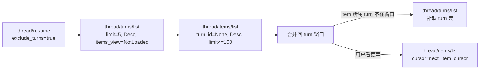

# Codex CLI 0.160.0 的 transcript 存储与分页读取

本文服务于 [裁决长 transcript 的分页、虚拟化与懒加载机制](https://github.com/leike0813/orca-companion/issues/53) 的存储与读取一侧，回答三件事：权威正文存在哪里、分页接口是什么、真实 TUI 到底怎么调。前端 layout、Markdown、搜索、缓存与阅读锚点已由主代理核验，本文不重复。

**结论：** 在 `history_mode = Paginated` 的线程上，Codex 0.160.0 不再整段读出再切片：它以 rollout JSONL 为权威，另建一份 SQLite 派生投影供分页，分页游标是 rollout ordinal 的 keyset 并绑定 thread 与 scope。分页接口只限条数、不限字节，单条 item 在读取侧整条返回，没有正文范围读取；item 的大小边界来自写入前的 producer 截断，不来自读取接口。模型上下文的冷读是有条件的反向扫描：存在最近一次可完整重建的 compaction 时才是后缀扫描，否则退化为扫描整段历史。真实 TUI 用 `thread/turns/list` 取 turn 壳、用 `thread/items/list` 取正文，内容分页在 item 级而非 turn 级。

## 核验环境

| 项 | 值 |
| --- | --- |
| 版本 / commit | Codex CLI `rust-v0.160.0` / `a956835d020762cb2b570053af06f643a11c0ecc`（2026-10-01T20:19:13Z） |
| 一手源码 | 本地快照 `codex-rs/`，workspace `version = "0.160.0"`；无 CodeGraph，用 `rg` 定向检索 |
| 方法 | 从 app-server RPC 入口追到 thread-store 查询，再到 rollout 投影与 core 会话恢复 |
| 未做 | 未运行真实会话或 app-server，无任何实测耗时/内存；未核验前端展开详情路径 |

所有链接固定在上表 commit，行号基于该快照。

## 0. `history_mode` 的前提（不是无条件默认）

本文讨论的快速分页链路只对 `Paginated` 线程成立，不能当作无条件默认。源码里的相关事实：

- `ThreadHistoryMode` 的枚举与 serde 默认是 `Legacy`（[protocol.rs L777-L784](https://github.com/openai/codex/blob/a956835d020762cb2b570053af06f643a11c0ecc/codex-rs/protocol/src/protocol.rs#L777-L784)），thread 元数据构建器的初始值也是 `Legacy`（[thread_metadata.rs L267](https://github.com/openai/codex/blob/a956835d020762cb2b570053af06f643a11c0ecc/codex-rs/state/src/model/thread_metadata.rs#L267)）。
- `thread/start` 会在满足条件时把新线程提升为 `Paginated`：非 ephemeral 且 thread store 支持分页列表（[thread_processor.rs L1462-L1465](https://github.com/openai/codex/blob/a956835d020762cb2b570053af06f643a11c0ecc/codex-rs/app-server/src/request_processors/thread_processor.rs#L1462-L1465)）。
- 已有旧文件的批量迁移由 `BackgroundPaginatedRolloutMigration` 控制，该 feature 是 `UnderDevelopment` 且 `default_enabled: false`（[features/src/lib.rs L189-L195](https://github.com/openai/codex/blob/a956835d020762cb2b570053af06f643a11c0ecc/codex-rs/features/src/lib.rs#L189-L195)、[L1183-L1188](https://github.com/openai/codex/blob/a956835d020762cb2b570053af06f643a11c0ecc/codex-rs/features/src/lib.rs#L1183-L1188)）。提升也可发生在子线程继承父线程为 paginated 时（[spawn.rs L728-L742](https://github.com/openai/codex/blob/a956835d020762cb2b570053af06f643a11c0ecc/codex-rs/core/src/agent/control/spawn.rs#L728-L742)）。

`LocalThreadStore::supports_paginated_history_lists()` 的条件已核验为 `state_db.is_some()`（[local/mod.rs L714-L716](https://github.com/openai/codex/blob/a956835d020762cb2b570053af06f643a11c0ecc/codex-rs/thread-store/src/local/mod.rs#L714-L716)）。因此非 ephemeral 且有 state DB 的这条新线程创建路径选择 Paginated。未核验具体安装/配置是否提供 state DB，以及生产 rollout 的 legacy/paginated 分布；不对所有会话作无条件默认声明。下文凡称快速分页路径，均指 `Paginated` 线程。

## 1. 权威与派生：正文有两份表示

权威是 rollout JSONL。paginated 格式只持久规范化记录 `ItemCompleted(TurnItem)` 与 turn 生命周期事件（[thread_history_projection.rs L1-L11](https://github.com/openai/codex/blob/a956835d020762cb2b570053af06f643a11c0ecc/codex-rs/app-server-protocol/src/protocol/thread_history_projection.rs#L1-L11)、[canonicalizer.rs L1-L10](https://github.com/openai/codex/blob/a956835d020762cb2b570053af06f643a11c0ecc/codex-rs/thread-store/src/local/rollout_migration/canonicalizer.rs#L1-L10)）。

SQLite 是**派生副本**，不是第二权威：表为 `thread_turns` / `thread_items` / `thread_realtime_items` / `thread_history_projection_state`（[thread_history.rs L103-L244](https://github.com/openai/codex/blob/a956835d020762cb2b570053af06f643a11c0ecc/codex-rs/thread-store/src/local/thread_history.rs#L103-L244)）。`apply_projection` 在一个 `BEGIN IMMEDIATE` 事务里写投影行并推进 `(next_rollout_byte_offset, next_rollout_ordinal)` 检查点，offset 对不上就 fail closed。投影是增量的：`materialize_to_sqlite` 从上次字节偏移继续读 rollout 尾部，只处理完整换行前缀（[materialization L22-L35](https://github.com/openai/codex/blob/a956835d020762cb2b570053af06f643a11c0ecc/codex-rs/thread-store/src/local/thread_history_materialization.rs#L22-L35)、[L85-L140](https://github.com/openai/codex/blob/a956835d020762cb2b570053af06f643a11c0ecc/codex-rs/thread-store/src/local/thread_history_materialization.rs#L85-L140)），写入后触发（[live_writer.rs L171](https://github.com/openai/codex/blob/a956835d020762cb2b570053af06f643a11c0ecc/codex-rs/thread-store/src/local/live_writer.rs#L171)），删除 thread 时一并清空、可从 rollout 重建（[thread_history.rs L244-L275](https://github.com/openai/codex/blob/a956835d020762cb2b570053af06f643a11c0ecc/codex-rs/thread-store/src/local/thread_history.rs#L244-L275)）。

关键点：分页返回的正文来自投影里的 `item_json`，即完整 `ThreadItem` 的一份序列化副本（[types.rs L514-L530](https://github.com/openai/codex/blob/a956835d020762cb2b570053af06f643a11c0ecc/codex-rs/thread-store/src/types.rs#L514-L530)、[read.rs L409-L425](https://github.com/openai/codex/blob/a956835d020762cb2b570053af06f643a11c0ecc/codex-rs/thread-store/src/local/thread_history/read.rs#L409-L425)），不是从 JSONL 现读。item 身份是 `(thread_id, turn_id, item_id)`，重复投影幂等 upsert 并保留首次 ordinal（[thread_history.rs L200-L230](https://github.com/openai/codex/blob/a956835d020762cb2b570053af06f643a11c0ecc/codex-rs/thread-store/src/local/thread_history.rs#L200-L230)）。

派生副本本身不等于 SSOT 冲突：它由权威确定性重建、带幂等身份，也是很常见的设计。但它确实带来正文的物理重复与副本一致性成本；本票有一条额外约束「正文单一权威、不复制正文」，在这条约束下我们才不照搬它（详见第 7 节）。

## 2. 分页接口与游标

两条后端路径。paginated 走投影表查询，入口 [thread_processor.rs L884-L900](https://github.com/openai/codex/blob/a956835d020762cb2b570053af06f643a11c0ecc/codex-rs/app-server/src/request_processors/thread_processor.rs#L884-L900)，实现在 [L3218](https://github.com/openai/codex/blob/a956835d020762cb2b570053af06f643a11c0ecc/codex-rs/app-server/src/request_processors/thread_processor.rs#L3218)（turns）与 [L3432](https://github.com/openai/codex/blob/a956835d020762cb2b570053af06f643a11c0ecc/codex-rs/app-server/src/request_processors/thread_processor.rs#L3432)（items），落到 [read.rs L101](https://github.com/openai/codex/blob/a956835d020762cb2b570053af06f643a11c0ecc/codex-rs/thread-store/src/local/thread_history/read.rs#L101)。legacy 路径则每次请求整体重放整段 rollout，再由 `paginate_thread_turns` 在内存里按 turn id 线性定位切片（[thread_processor.rs L3073-L3125](https://github.com/openai/codex/blob/a956835d020762cb2b570053af06f643a11c0ecc/codex-rs/app-server/src/request_processors/thread_processor.rs#L3073-L3125)、[L5640-L5700](https://github.com/openai/codex/blob/a956835d020762cb2b570053af06f643a11c0ecc/codex-rs/app-server/src/request_processors/thread_processor.rs#L5640-L5700)）；其注释说明：分页只省了网络传输，服务端仍要重建完整 turn 列表，直到 turn 元数据被单独索引。

投影游标是 keyset：`{requested_thread_id, rollout_ordinal, include_anchor, scope}`，解析时校验 thread 与 scope（`Turns` / `ItemsByCreatedAtOrdinal` / `ItemsByUpdatedAtOrdinal`），不做 OFFSET 深扫，用 `page_size + 1` 探测下一页（[read.rs L32-L48](https://github.com/openai/codex/blob/a956835d020762cb2b570053af06f643a11c0ecc/codex-rs/thread-store/src/local/thread_history/read.rs#L32-L48)、[L255-L285](https://github.com/openai/codex/blob/a956835d020762cb2b570053af06f643a11c0ecc/codex-rs/thread-store/src/local/thread_history/read.rs#L255-L285)、[segment_paging.rs L34-L42](https://github.com/openai/codex/blob/a956835d020762cb2b570053af06f643a11c0ecc/codex-rs/thread-store/src/local/thread_history/segment_paging.rs#L34-L42)、[L488-L520](https://github.com/openai/codex/blob/a956835d020762cb2b570053af06f643a11c0ecc/codex-rs/thread-store/src/local/thread_history/segment_paging.rs#L488-L520)）。legacy 游标是 `{turn_id, include_anchor}`，同一个 `cursor` 参数在两套后端下语义不同，调用方无感知（[thread_processor.rs L5660-L5700](https://github.com/openai/codex/blob/a956835d020762cb2b570053af06f643a11c0ecc/codex-rs/app-server/src/request_processors/thread_processor.rs#L5660-L5700)）。

契约见 [v2/thread.rs L1705-L1811](https://github.com/openai/codex/blob/a956835d020762cb2b570053af06f643a11c0ecc/codex-rs/app-server-protocol/src/protocol/v2/thread.rs#L1705-L1811)：turns 默认降序、items 默认升序；`backwards_cursor` 用于反向后仍含锚点页，便于看到该页更新；items 另有 turn 内 `Anchor { item_id }`。单页条数默认 25、上限 100（[thread_processor.rs L5584-L5587](https://github.com/openai/codex/blob/a956835d020762cb2b570053af06f643a11c0ecc/codex-rs/app-server/src/request_processors/thread_processor.rs#L5584-L5587)）。另有一层非条数裁剪 `TurnItemsView::{NotLoaded, Summary, Full}`，`Summary` 只保留该 turn 首条 user message 与末条 agent message（[thread_data.rs L411](https://github.com/openai/codex/blob/a956835d020762cb2b570053af06f643a11c0ecc/codex-rs/app-server-protocol/src/protocol/v2/thread_data.rs#L411)、[turn_items_view.rs L1-L33](https://github.com/openai/codex/blob/a956835d020762cb2b570053af06f643a11c0ecc/codex-rs/app-server-protocol/src/protocol/turn_items_view.rs#L1-L33)）。历史被 rollback/compaction 重写时，投影按 lineage segment 排除旧段里已被新段覆盖的 turn（[segment_paging.rs L85-L140](https://github.com/openai/codex/blob/a956835d020762cb2b570053af06f643a11c0ecc/codex-rs/thread-store/src/local/thread_history/segment_paging.rs#L85-L140)）。

## 3. 字节边界：读取侧没有正文范围

准确地说：**分页 API 与存储读取层没有字节 limit**。`ListTurnsParams` / `ListItemsParams` 只有 `page_size`、方向、position、items_view（[types.rs L425-L513](https://github.com/openai/codex/blob/a956835d020762cb2b570053af06f643a11c0ecc/codex-rs/thread-store/src/types.rs#L425-L513)），协议参数同样没有字节字段；单条 item 是整条返回的 `ThreadItemEntry`（[v2/thread.rs L1781-L1811](https://github.com/openai/codex/blob/a956835d020762cb2b570053af06f643a11c0ecc/codex-rs/app-server-protocol/src/protocol/v2/thread.rs#L1781-L1811)），服务端把 `item_json` 整列反序列化，没有内容范围接口。

但「没有读取侧上限」不等于「单条可以无限大」。item 在写入之前已被 producer/tool 层按 token 预算截断：命令与工具输出经 `TruncationPolicy` 处理后才会成为历史项（[core/tools/context.rs L444-L500](https://github.com/openai/codex/blob/a956835d020762cb2b570053af06f643a11c0ecc/codex-rs/core/src/tools/context.rs#L444-L500)、[output-truncation lib.rs L12-L36](https://github.com/openai/codex/blob/a956835d020762cb2b570053af06f643a11c0ecc/codex-rs/utils/output-truncation/src/lib.rs#L12-L36)、[protocol.rs L3386-L3415](https://github.com/openai/codex/blob/a956835d020762cb2b570053af06f643a11c0ecc/codex-rs/protocol/src/protocol.rs#L3386-L3415)）。所以单条的大小边界来自上游 producer 策略，不来自分页读取接口；我无法从源码断言所有 item 类型都被同一预算约束。

其它字节约束都服务别处：`ReverseJsonlScanner` 的 64 KiB 读块与 `max_record_bytes` 用于反向扫描限内存（[reverse_jsonl_scanner.rs L11-L30](https://github.com/openai/codex/blob/a956835d020762cb2b570053af06f643a11c0ecc/codex-rs/rollout/src/reverse_jsonl_scanner.rs#L11-L30)、[L66-L80](https://github.com/openai/codex/blob/a956835d020762cb2b570053af06f643a11c0ecc/codex-rs/rollout/src/reverse_jsonl_scanner.rs#L66-L80)），实际用于迁移扫描（16 MiB）与 resume picker 旧格式预览（1 MiB）；面向模型的历史工具按字符截断（默认 2000、上限 20000，[dynamic_tools.rs L73-L76](https://github.com/openai/codex/blob/a956835d020762cb2b570053af06f643a11c0ecc/codex-rs/tui/src/dynamic_tools.rs#L73-L76)）。

## 4. 真实 TUI 调用的接口（turns vs items 的分工）

0.160.0 的 TUI 是 app-server 客户端。核心链路在 `tui/src/app_server_session/history.rs`：

| 步骤 | RPC | 关键参数 | 作用 | 证据 |
| --- | --- | --- | --- | --- |
| 初始 turn 壳 | `thread/turns/list` | `limit=5`、Desc、`items_view=NotLoaded` | 只取 turn 元数据，得到窗口与游标 | [L237-L252](https://github.com/openai/codex/blob/a956835d020762cb2b570053af06f643a11c0ecc/codex-rs/tui/src/app_server_session/history.rs#L237-L252)、[L343](https://github.com/openai/codex/blob/a956835d020762cb2b570053af06f643a11c0ecc/codex-rs/tui/src/app_server_session/history.rs#L343) |
| 正文分页 | `thread/items/list` | `turn_id=None`、Desc、`limit<=100`，受行数+条数双预算 | 跨 turn 取真实内容 | [L222-L236](https://github.com/openai/codex/blob/a956835d020762cb2b570053af06f643a11c0ecc/codex-rs/tui/src/app_server_session/history.rs#L222-L236)、[L102-L115](https://github.com/openai/codex/blob/a956835d020762cb2b570053af06f643a11c0ecc/codex-rs/tui/src/app_server_session/history.rs#L102-L115)、[L355-L370](https://github.com/openai/codex/blob/a956835d020762cb2b570053af06f643a11c0ecc/codex-rs/tui/src/app_server_session/history.rs#L355-L370) |
| 补缺 turn | `thread/turns/list` | `cursor=next_turn_cursor`、`limit=min(missing,100)` | item 落在窗口外时补 turn 壳 | [L255-L300](https://github.com/openai/codex/blob/a956835d020762cb2b570053af06f643a11c0ecc/codex-rs/tui/src/app_server_session/history.rs#L255-L300) |
| 更早历史 | `thread/items/list` | `cursor=next_item_cursor` | 用户请求时才取，不预取 | [L60-L80](https://github.com/openai/codex/blob/a956835d020762cb2b570053af06f643a11c0ecc/codex-rs/tui/src/app_server_session/history.rs#L60-L80)、[L188-L230](https://github.com/openai/codex/blob/a956835d020762cb2b570053af06f643a11c0ecc/codex-rs/tui/src/app_server_session/history.rs#L188-L230) |
| resume 前置 | `thread/resume` | `exclude_turns=true` | 先拿元数据，再分页水合 | [app_server_session.rs L922-L1010](https://github.com/openai/codex/blob/a956835d020762cb2b570053af06f643a11c0ecc/codex-rs/tui/src/app_server_session.rs#L922-L1010) |

三条明确回答：

- **turns/list 是壳，items/list 是内容。** 初始窗口只取 turn 元数据（`items_view=NotLoaded`），正文一律走 item 页；内容分页在 item 级、跨 turn（`turn_id=None`），不是「按完整 turn 取页」。turn 级全文只出现在 `items_view=Full` 或兼容路径。
- **是否 readall 后 slice：分情况。** paginated 主路径不是；legacy 路径是（服务端整体重放，TUI 侧 `thread/read(includeTurns=true)` 后再内存切片）；导出是（`HistoryHydrationScope::Complete` 让行数/条数预算都为 `None`，[transcript_export.rs L96-L120](https://github.com/openai/codex/blob/a956835d020762cb2b570053af06f643a11c0ecc/codex-rs/tui/src/app/transcript_export.rs#L96-L120)、[history.rs L68-L79](https://github.com/openai/codex/blob/a956835d020762cb2b570053af06f643a11c0ecc/codex-rs/tui/src/app_server_session/history.rs#L68-L79)）；模型 facing 的 `read_thread` 工具在不支持分页时也是先全量再截尾（[dynamic_tools.rs L390-L430](https://github.com/openai/codex/blob/a956835d020762cb2b570053af06f643a11c0ecc/codex-rs/tui/src/dynamic_tools.rs#L390-L430)）。
- **单条大 item 怎么读：整条读。** `thread/items/list` 直接返回完整 `ThreadItem`，没有按段读取；读取侧的降级手段只有 summaries 视图与调用方字符截断。

另一调用方是模型 facing 的 `read_thread` 工具：`thread/turns/list`（`items_view=Full`）+ `thread/items/list`（`turn_id=Some`、limit 20），并用字符预算截断每个 item（[dynamic_tools.rs L373-L430](https://github.com/openai/codex/blob/a956835d020762cb2b570053af06f643a11c0ecc/codex-rs/tui/src/dynamic_tools.rs#L373-L430)、[L830-L840](https://github.com/openai/codex/blob/a956835d020762cb2b570053af06f643a11c0ecc/codex-rs/tui/src/dynamic_tools.rs#L830-L840)）。服务端为旧客户端保留了全量兼容 loop（turns 与 items 各按 100 循环拉满，[thread_processor.rs L3291-L3322](https://github.com/openai/codex/blob/a956835d020762cb2b570053af06f643a11c0ecc/codex-rs/app-server/src/request_processors/thread_processor.rs#L3291-L3322)、[L3330-L3355](https://github.com/openai/codex/blob/a956835d020762cb2b570053af06f643a11c0ecc/codex-rs/app-server/src/request_processors/thread_processor.rs#L3330-L3355)），并对 `thread/read(includeTurns=true)` 发弃用提示（[L40](https://github.com/openai/codex/blob/a956835d020762cb2b570053af06f643a11c0ecc/codex-rs/app-server/src/request_processors/thread_processor.rs#L40)、[v2/thread.rs L1671-L1684](https://github.com/openai/codex/blob/a956835d020762cb2b570053af06f643a11c0ecc/codex-rs/app-server-protocol/src/protocol/v2/thread.rs#L1671-L1684)）。

## 5. 模型活跃 context 的读取路径

运行中的会话把有效上下文放在内存：`ContextManager.items: Arc<Vec<ResponseItemEnvelope>>`（[history.rs L91-L115](https://github.com/openai/codex/blob/a956835d020762cb2b570053af06f643a11c0ecc/codex-rs/core/src/context_manager/history.rs#L91-L115)），`for_prompt` 每回合 `Arc::unwrap_or_clone` 整个向量再归一化（[L581-L595](https://github.com/openai/codex/blob/a956835d020762cb2b570053af06f643a11c0ecc/codex-rs/core/src/context_manager/history.rs#L581-L595)）。冷启动/恢复时，`load_latest_model_context` 对 paginated rollout 从 lineage 段尾反向扫描；遇到同时有 replacement history 与 window number 的最近 compaction 时，返回该 compaction 及其后缀。若最新 compaction 缺任一字段，或根本没有 compaction，就继续扫到 rollout 开头。[加载入口](https://github.com/openai/codex/blob/a956835d020762cb2b570053af06f643a11c0ecc/codex-rs/thread-store/src/local/model_context.rs#L35-L75)、[反向扫描](https://github.com/openai/codex/blob/a956835d020762cb2b570053af06f643a11c0ecc/codex-rs/thread-store/src/local/model_context.rs#L163-L193)、[停止条件](https://github.com/openai/codex/blob/a956835d020762cb2b570053af06f643a11c0ecc/codex-rs/rollout/src/model_context.rs#L11-L59)。随后结果经 `InitialHistory::Resumed` 装回内存。[spawn](https://github.com/openai/codex/blob/a956835d020762cb2b570053af06f643a11c0ecc/codex-rs/core/src/agent/control/spawn.rs#L340-L375)、[record_initial_history](https://github.com/openai/codex/blob/a956835d020762cb2b570053af06f643a11c0ecc/codex-rs/core/src/session/mod.rs#L1534-L1610)。

所以「冷读有界」是有条件的：压缩边界存在时是有界后缀，否则是整段历史。另外 Codex 每回合仍遍历内存中的全部历史项，靠压缩把向量变小；它并没有做到「模型准备按增量读取」。

## 6. 冷读成本：源码明写的局限

- 投影冷启动整段读进内存：`read_projection_steps` 按 `byte_count` 一次性分配并 `read_exact`，首次即整个 rollout 文件，之后按偏移增量（[materialization L109-L125](https://github.com/openai/codex/blob/a956835d020762cb2b570053af06f643a11c0ecc/codex-rs/thread-store/src/local/thread_history_materialization.rs#L109-L125)）。
- 压缩 rollout 冷读整体解压到匿名临时文件（[seekable_reader.rs L63-L80](https://github.com/openai/codex/blob/a956835d020762cb2b570053af06f643a11c0ecc/codex-rs/rollout/src/seekable_reader.rs#L63-L80)、[compression.rs L48-L53](https://github.com/openai/codex/blob/a956835d020762cb2b570053af06f643a11c0ecc/codex-rs/rollout/src/compression.rs#L48-L53)）。
- legacy 分页每次请求重放整个 rollout，且 O(n) 定位游标；模型上下文在没有可用 compaction 时同样全量扫描。
- 读取侧对单条 item 无字节上限，只依赖 producer 写入前的 token 截断。

## 7. 对照 issue #53 草案

直接可用：ordinal keyset + `backwards_cursor`/`include_anchor` 对应「稳定顺序 + 新消息不移动旧页边界」；item 级 anchor 对应「工具调用/结果跨页关联」；投影 + `(byte_offset, ordinal)` 检查点同事务、幂等 upsert 对应「增量写、同事务、稳定身份」；lineage segment 排除被重写 turn 对应「历史前插/重写不破坏已取页」；反向扫描停在最近完整 compaction 支持「模型只读当前有效上下文」，但要带上第 5 节的条件；`items_view` 摘要化支持「折叠摘要与详情分开读」。

不能照抄：

- 分页性能来自把正文复制进派生投影（`thread_items.item_json`）。该投影本身不是第二权威，也与 SSOT 不天然冲突，但本票额外约束「不复制正文」，所以不照搬这套派生副本方案；若要同等性能，需要自己做权威侧的正文范围读取，上游没有现成答案。
- 读取侧没有字节分页，也没有 16 KiB/64 KiB 正文范围读取。草案这两条在 0.160.0 找不到先例，只能靠我们自己的探针界定；item 的大小边界在上游来自 producer 的 token 截断，与我们想做的「按内容范围读取」不是一回事。
- legacy 兼容双路径不要学。项目尚无初版、不规划迁移，直接做成 paginated-only 即可；照搬兼容层只会引入不需要的复杂度和「整段读再切片」的风险面。

## 8. 未验证边界

- 无真实会话/app-server 实测，文中没有任何性能数字。
- 已核验本地 store 的支持条件为存在 state DB；未核验具体安装/配置下的 state DB 状态与生产 rollout 的 legacy/paginated 实际分布，因此不能对所有会话说「当前默认就是 paginated」。
- 未逐一核验所有 item 类型是否都受同一 producer 截断预算约束。
- 前端展开详情、Markdown、搜索、缓存、阅读锚点由其他核验负责，本文未覆盖。
- 是否据此修正 issue #53 草案的具体条目，需与用户讨论后决定；本文只给机制与边界。
